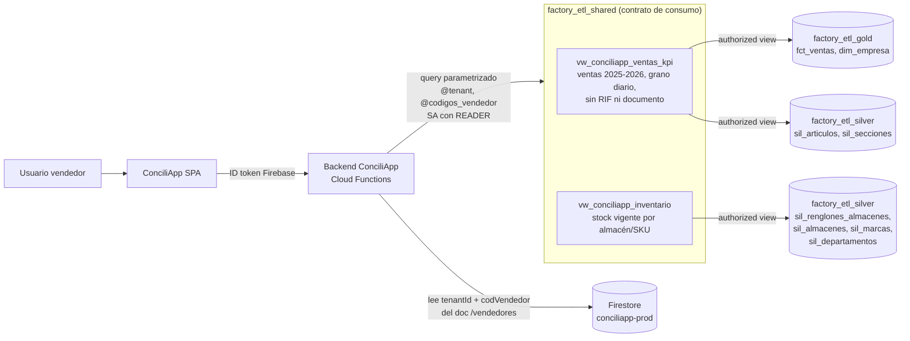

# 🔒 PLAN DE IMPLEMENTACIÓN — GOBERNANZA Y RLS DE `factory-etl`

> **Estado:** Fase 1 implementada y verificada en `factory-etl-dev-0y1dhf` (2026-08-02).
> **Decisión de arquitectura:** enforcement de acceso en la **capa de aplicación** (ConciliApp),
> con **contratos de consumo** (authorized views) en BigQuery. **Se excluye** el sync
> Firestore→BigQuery (`sec_vendedores_auth`) y el RLS nativo con `ROW ACCESS POLICY`.

---

## 1. Contexto y decisiones tomadas

| Decisión | Alternativa descartada | Justificación |
|---|---|---|
| **PEP en ConciliApp** (backend filtra por usuario) | RLS nativo BigQuery (`ROW ACCESS POLICY` + `SESSION_USER()`) | ConciliApp ya autentica al usuario con Firebase Auth y conoce su `tenantId` + `codVendedor` en Firestore. BigQuery solo ve la cuenta de servicio, por lo que el RLS nativo no identificaría al usuario final. |
| **Sin sync Firestore→BigQuery** | Tabla `factory_etl_security.sec_vendedores_auth` sincronizada | Elimina un pipeline con estado (staleness, ventanas de truncate, doble fuente de verdad). La identidad vive únicamente en Firestore/`conciliapp-prod`. |
| **Contratos de consumo en dataset dedicado** (`factory_etl_shared`) | Grant directo sobre Gold/Silver | Mínima exposición: la SA externa solo ve vistas acotadas, nunca las capas del warehouse. |
| **Vistas agregadas sin PII** | Exponer `vw_detalle_facturacion_clientes` completa | El dashboard de KPIs no necesita RIF, documento ni renglón; se excluyen por diseño. |

### Trade-off aceptado explícitamente

Sin `ROW ACCESS POLICY` en las tablas base, **cualquier identidad humana con `dataViewer`
sobre `factory_etl_gold` ve el 100% de las 5 empresas**. Esto es aceptable mientras el
acceso directo a Gold quede restringido a analistas/directiva con alcance global
(`ANALISTA_VENTAS`, `SUPERADMIN` de la matriz del README §5). **Regla operativa:** no
otorgar `dataViewer` de Gold/Silver a vendedores, supervisores ni proveedores externos.
Si en el futuro se requiere acceso directo por usuario (Power BI DirectQuery con OAuth
personal), se activa la Fase 4 (RLS nativo, §7).

---

## 2. Patrón: contratos de consumo con enforcement en aplicación



Principios (heredados de `PROPUESTA_INTEGRACION_CONCILIAPP.md`):

1. **Cero credenciales de BigQuery en el navegador.** El SPA solo habla con su backend.
2. **Fail-closed.** Usuario sin `codVendedor` vigente en Firestore ⇒ cero filas y
   dashboard vacío explícito; nunca un error que revele nombres de tablas o campos.
3. **Mínima exposición.** Las vistas exponen solo las columnas que el dashboard necesita.
   Sin RIF, sin GPS, sin número de documento/renglón.
4. **Filtro obligatorio por diseño de contrato.** Toda consulta del backend incluye
   `WHERE tenant = @tenant` (y `codigo_vendedor IN UNNEST(@codigos)` en ventas).
5. **Parámetros nombrados siempre** (`QueryParameter`), nunca interpolación de strings.

---

## 3. Recursos implementados (Fase 1 — ✅ completada)

Script idempotente: [`scratch/create_conciliapp_ventas_view.py`](scratch/create_conciliapp_ventas_view.py)

### 3.1 Dataset `factory_etl_shared`

- Ubicación: `us-central1`, proyecto `factory-etl-dev-0y1dhf`.
- Propósito: contratos de consumo para aplicaciones externas. Es el **único** dataset
  donde se otorgan permisos a cuentas de servicio de otros productos.

### 3.2 Vista `vw_conciliapp_ventas_kpi`

- **Fuente:** `factory_etl_gold.fct_ventas` + `sil_articulos` + `sil_secciones`.
- **Alcance temporal fijo:** `fecha_registro BETWEEN '2025-01-01' AND '2026-12-31'`.
- **Grano:** día × tenant × sucursal × vendedor × cliente × SKU (agregado con `GROUP BY`;
  el documento/renglón no es recuperable).

| Grupo | Columnas |
|---|---|
| Claves de filtro | `tenant`, `codigo_sucursal`, `codigo_vendedor` |
| Descriptivas | `nombre_empresa`, `nombre_vendedor`, `codigo_cliente`, `nombre_cliente`, `clase_cliente`, `ciudad_cliente` |
| Tiempo comercial | `fecha`, `anio`, `mes`, `nombre_mes`, `anio_mes`, `trimestre`, `anio_trimestre`, `semana_del_anio`, `anio_semana`, `quincena`, `quincena_nombre` |
| Producto | `codigo_proveedor`, `nombre_proveedor`, `codigo_marca`, `nombre_marca`, `codigo_articulo`, `nombre_articulo`, `nombre_departamento`, `nombre_seccion` |
| Atributos unitarios SKU | `fraccion_unitaria`, `peso_unitario_kg` |
| Métricas | `documentos_emitidos`, `unidades_vendidas`, `cajas_vendidas`, `fraccion_total`, `peso_total_kg`, `toneladas_vendidas`, `venta_bruta`, `descuentos`, `venta_neta_usd` |

Notas técnicas:
- `nom_sec` **no existe** en `fct_ventas`; se resuelve con join a `sil_secciones`
  (clave natural única `source_empresa + cod_sec`, sin riesgo de fan-out).
- `fraccion` proviene de `articulos.volumen` en el origen eFactory
  (`src/factory_etl/factory_queries/masters/articulos.sql`); `fraccion_total`
  = `SUM(volumen_total_m3)` = `Σ can_ven × fraccion`.
- `peso_unitario_kg` = `sil_articulos.peso`; `peso_total_kg` = `Σ can_ven × peso`.

### 3.3 Vista `vw_conciliapp_inventario`

- **Fuente:** `sil_renglones_almacenes` (snapshot full) + `sil_almacenes`,
  `sil_articulos`, `sil_marcas`, `sil_departamentos`, `sil_secciones`, `dim_empresa`.
- **Filtro:** `exi_act1 > 0` (solo stock vigente).
- **Grano:** tenant × almacén × SKU.

| Grupo | Columnas |
|---|---|
| Claves de filtro | `tenant`, `codigo_almacen` |
| Descriptivas | `nombre_empresa`, `nombre_almacen`, `codigo_articulo`, `nombre_articulo`, `modelo`, `codigo_marca`, `nombre_marca`, `codigo_proveedor`, `nombre_departamento`, `nombre_seccion` |
| Atributos unitarios SKU | `unidades_por_caja`, `fraccion_unitaria`, `peso_unitario_kg` |
| Métricas | `stock_unidades`, `stock_cajas`, `fraccion_total`, `peso_total_kg`, `peso_total_toneladas` |
| Auditoría | `fecha_ultima_actualizacion` |

> [!NOTE]
> Verificado 2026-08-02: `ctb` (2,196 filas / 418.8 ton), `ctm`, `daroan`, `roldan` con
> datos. **`tinito` no tiene snapshot de inventario cargado** (`exi_act1 > 0` vacío):
> es una brecha de ingesta de `renglones_almacenes_v1`, no un defecto de la vista.

### 3.4 Authorized Views

Ambas vistas están registradas como *authorized views* sobre `factory_etl_gold` **y**
`factory_etl_silver`. Consecuencia: la SA de ConciliApp consulta las vistas **sin ningún
permiso** sobre Gold/Silver.

---

## 4. Contrato de consumo para el backend de ConciliApp

### 4.1 IAM requerido (Fase 2 — pendiente)

```bash
# Único grant necesario (re-ejecutar el script con el email de la SA):
uv run python scratch/create_conciliapp_ventas_view.py sa-conciliapp@<proyecto>.iam.gserviceaccount.com
```

| Permiso | Recurso | Rol |
|---|---|---|
| Leer las vistas | Dataset `factory_etl_shared` | `READER` (dataset-level) |
| Ejecutar queries | Proyecto `factory-etl-dev-0y1dhf` | `roles/bigquery.jobUser` |
| Gold / Silver / Bronze / control | — | **ninguno** |

El `jobUser` se otorga por consola/gcloud (no lo gestiona el script):

```bash
gcloud projects add-iam-policy-binding factory-etl-dev-0y1dhf \
  --member="serviceAccount:sa-conciliapp@<proyecto>.iam.gserviceaccount.com" \
  --role="roles/bigquery.jobUser"
```

### 4.2 Patrón de consulta obligatorio (lado ConciliApp)

```javascript
// Node.js (Cloud Functions de ConciliApp)
const [rows] = await bigquery.query({
  query: `
    SELECT anio_mes,
           SUM(venta_neta_usd)          AS venta_usd,
           SUM(cajas_vendidas)          AS cajas,
           COUNT(DISTINCT codigo_cliente) AS clientes_atendidos
    FROM \`factory-etl-dev-0y1dhf.factory_etl_shared.vw_conciliapp_ventas_kpi\`
    WHERE tenant = @tenant
      AND codigo_vendedor IN UNNEST(@codigos_vendedor)   -- multi-ruta
    GROUP BY 1 ORDER BY 1`,
  params: {
    tenant: user.tenantId.toLowerCase(),          // desde Firestore /vendedores
    codigos_vendedor: user.vendedores.map(v => v.codVendedor),
  },
  location: 'us-central1',
});
```

Reglas no negociables:

1. `tenant` y `codigos_vendedor` **siempre** provienen del documento Firestore del
   usuario autenticado (`verifyIdToken` → `/vendedores/{uid}`), jamás del request body.
2. Vendedor multi-ruta ⇒ `IN UNNEST(@codigos_vendedor)`. **Prohibido** omitir el filtro
   o usar un `codigo_vendedor IS NULL` que abra todo el tenant.
3. Usuario sin `codVendedor` vigente o `isActive = false` ⇒ el backend responde con
   dataset vacío (fail-closed), sin consultar BigQuery.
4. Inventario: filtrar como mínimo por `tenant` (no tiene dimensión vendedor). Si el
   negocio exige acotar por sucursal, mapear `codSucursal` del usuario → `codigo_almacen`.
5. Roles gerenciales/analistas de ConciliApp (acceso a todo un tenant o varios): el
   backend decide los tenants permitidos desde Firestore y consulta con
   `tenant IN UNNEST(@tenants)`; el mismo patrón, sin excepciones.

---

## 5. Gobernanza del lado `factory-etl`

### 5.1 Reglas de administración del dataset `factory_etl_shared`

- **Un contrato por consumidor:** vistas con prefijo `vw_conciliapp_*`. Un futuro
  consumidor (ej. portal de proveedores) recibe sus propias vistas `vw_<consumidor>_*`,
  nunca reutiliza las de otro.
- **Cambios de esquema son cambios de contrato:** agregar columnas es compatible;
  renombrar/eliminar requiere coordinación con el equipo de ConciliApp y versionado
  (`vw_conciliapp_ventas_kpi_v2` durante la transición).
- **Nada de tablas materializadas con PII** en `shared`; solo vistas sobre Gold/Silver.
- El script de creación es **idempotente** y es la única vía de cambio (no editar
  vistas a mano en consola).

### 5.2 Matriz de acceso a datasets (estado objetivo)

| Principal | `shared` | `gold` | `silver` | `bronze_stg` | `security`* | `control_dev` |
|---|---|---|---|---|---|---|
| SA ConciliApp | READER | — | — | — | — | — |
| SA Dataform / Cloud Run ETL | — | WRITER | WRITER | WRITER | — | WRITER |
| Analistas / Directiva (`@tinitot.com` global) | — | READER | — | — | — | — |
| Ingeniería de datos | OWNER | OWNER | OWNER | OWNER | OWNER | OWNER |
| Vendedores / supervisores / proveedores | — | — | — | — | — | — |

\* `factory_etl_security` queda **congelado** (sin sync activo). No eliminar el dataset
hasta cerrar la Fase 4 o descartar definitivamente el RLS nativo.

### 5.3 Auditoría y monitoreo

- **Quién consulta qué:** `region-us-central1.INFORMATION_SCHEMA.JOBS_BY_PROJECT`
  filtrado por `referenced_tables.dataset_id = 'factory_etl_shared'`. Revisión mensual:
  toda identidad distinta de la SA de ConciliApp es un hallazgo.
- **Frescura de datos del contrato:** el dashboard depende de la ingesta diaria
  (Cloud Scheduler 21:00/03:00 UTC). Reutilizar
  `scratch/check_workflow_executions.py` como control; una ingesta caída ⇒ KPIs viejos.
- **Brecha conocida:** snapshot de inventario de `tinito` ausente (§3.3). Acción:
  verificar la corrida de `renglones_almacenes_v1` para `tinito`.

---

## 6. Plan de fases

| Fase | Alcance | Estado |
|---|---|---|
| **1. Contratos de consumo** | Dataset `factory_etl_shared`, vistas `vw_conciliapp_ventas_kpi` y `vw_conciliapp_inventario`, authorized views sobre Gold y Silver, script idempotente | ✅ Hecha (2026-08-02) |
| **2. Habilitación de ConciliApp** | Grant `READER` a la SA (script con argumento) + `bigquery.jobUser`; implementación del patrón parametrizado y fail-closed en el backend de ConciliApp; prueba end-to-end con un vendedor real multi-ruta | ⬜ Pendiente (bloqueada por email de la SA) |
| **3. Endurecimiento de gobernanza** | Aplicar la matriz de acceso §5.2 (retirar grants amplios de Gold/Silver); query de auditoría mensual sobre `INFORMATION_SCHEMA.JOBS`; resolver snapshot de inventario de `tinito`; retirar `scratch/sync_firestore_vendedores_to_bigquery.py` del cheat sheet del README | ⬜ Pendiente |
| **4. (Opcional) RLS nativo para acceso directo** | Solo si se habilita Power BI/consola por usuario final: tablas `sec_principals` / `sec_principal_roles` / `sec_access_scopes`, TVF `tvf_scope(SESSION_USER())` y `ROW ACCESS POLICY` en `fct_ventas`, `sil_renglones_almacenes` y `dim_clientes`, gestionadas como `post_operations` de Dataform | ⏸️ Diferida |

### Criterios de salida por fase

- **Fase 2:** un usuario vendedor real ve exclusivamente sus rutas; un usuario
  desactivado en Firestore obtiene dashboard vacío; ninguna query del backend sin
  `@tenant`.
- **Fase 3:** `INFORMATION_SCHEMA.JOBS` de 30 días no muestra accesos a `shared` fuera
  de la SA; ningún principal no-global con `dataViewer` en Gold.
- **Fase 4 (si se activa):** cuenta de prueba sin scope ⇒ 0 filas en `fct_ventas` desde
  la consola de BigQuery.

---

## 7. Anexo — Diseño de referencia del RLS nativo (Fase 4, diferido)

Se conserva el diseño PDP/PEP evaluado, por si se habilita acceso directo por usuario:

```sql
-- PDP: única función de decisión
CREATE OR REPLACE TABLE FUNCTION factory_etl_security.tvf_scope(user_email STRING) AS (
  SELECT s.source_empresa, s.cod_suc, s.cod_ven, s.cod_pro,
         r.role_type IN ('SUPERADMIN','ANALISTA_VENTAS') AS is_global
  FROM factory_etl_security.sec_principals p
  JOIN factory_etl_security.sec_principal_roles r USING (correo)
  LEFT JOIN factory_etl_security.sec_access_scopes s USING (correo)
  WHERE p.correo = LOWER(user_email) AND p.status = 'A'
);

-- PEP: política declarativa por tabla base (las vistas heredan el filtro)
CREATE OR REPLACE ROW ACCESS POLICY rls_fct_ventas
ON factory_etl_gold.fct_ventas
GRANT TO ('domain:tinitot.com')
FILTER USING (EXISTS (
  SELECT 1 FROM factory_etl_security.tvf_scope(SESSION_USER()) sc
  WHERE sc.is_global
     OR ( sc.source_empresa = source_empresa
      AND (sc.cod_suc IS NULL OR sc.cod_suc = cod_suc)
      AND (sc.cod_ven IS NULL OR sc.cod_ven = cod_ven)
      AND (sc.cod_pro IS NULL OR sc.cod_pro = cod_pro))
));
```

Condiciones para activarla: identidades Google personales (OAuth) consultando Gold
directamente, alta gobernada de `sec_principals` (sin sync automático desde ConciliApp,
según `PROPUESTA_INTEGRACION_CONCILIAPP.md` §3) y políticas gestionadas como
`post_operations` en los SQLX de Dataform para sobrevivir a recreaciones de tablas.

---

## 8. Runbook operativo

```bash
# Crear/actualizar todo el contrato (idempotente)
uv run python scratch/create_conciliapp_ventas_view.py

# + Grant READER a la SA de ConciliApp
uv run python scratch/create_conciliapp_ventas_view.py sa-conciliapp@<proyecto>.iam.gserviceaccount.com

# Smoke test de las vistas (por tenant)
bq query --use_legacy_sql=false --location=us-central1 \
  "SELECT tenant, COUNT(*) filas FROM \`factory-etl-dev-0y1dhf.factory_etl_shared.vw_conciliapp_ventas_kpi\` GROUP BY 1"

# Auditoría: ¿quién consultó el dataset shared en los últimos 30 días?
bq query --use_legacy_sql=false --location=us-central1 \
  "SELECT user_email, COUNT(*) queries, MAX(creation_time) ultima
   FROM \`factory-etl-dev-0y1dhf.region-us-central1.INFORMATION_SCHEMA.JOBS_BY_PROJECT\`, UNNEST(referenced_tables) t
   WHERE t.dataset_id = 'factory_etl_shared' AND creation_time > TIMESTAMP_SUB(CURRENT_TIMESTAMP(), INTERVAL 30 DAY)
   GROUP BY 1 ORDER BY 2 DESC"
```
