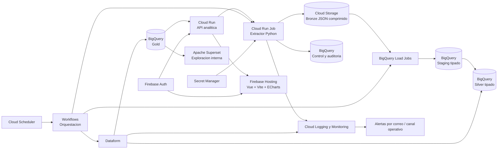

# Propuesta de data lake y data warehouse en GCP

## 1. Objetivo

Implementar en Google Cloud Platform una plataforma analitica centralizada para
extraer datos de FactorySoft, conservar su historia y publicar modelos confiables
para el sitio analitico web y otros consumidores autorizados.

La primera fuente sera la API generica de FactorySoft y las bases asociadas a:

- `tinito`
- `ctb`
- `ctm`
- `daroan` (codigo por confirmar en FactorySoft)
- `roldan` (codigo por confirmar en FactorySoft)

La plataforma seguira una arquitectura medallion con capas Bronze, Silver y
Gold. Cloud Storage funcionara como data lake de archivos inmutables y BigQuery
como motor del data warehouse. El ETL existente en Python sera la base del nuevo
extractor: ya contiene validacion de respuestas, limites, reintentos,
idempotencia por lotes y controles de seguridad que deben conservarse.

> Antes de cualquier prueba se debe revocar la API key incluida en la solicitud
> original. Al haber sido compartida en texto, debe considerarse comprometida.
> La nueva clave se almacenara exclusivamente en Secret Manager.

## 2. Principios de diseno

- Conservar en Bronze la respuesta original, sin sobrescribir objetos.
- Separar almacenamiento, transformacion y consumo.
- Hacer cada carga idempotente y trazable mediante `run_id`, `lote_id` y hash
  SHA-256 del contenido.
- Mantener `source_empresa` en todas las capas para evitar mezclar bases.
- Trabajar en UTC para auditoria tecnica y conservar `America/Caracas` como zona  de negocio para fechas operativas.
- Aplicar minimo privilegio, secretos centralizados y cifrado en transito y en  reposo.
- Empezar con servicios serverless y agregar componentes de mayor complejidad  solo cuando el volumen o la orquestacion lo justifiquen.
- Administrar infraestructura, esquemas y transformaciones como codigo.

## 3. Arquitectura propuesta



### Flujo diario

1. Cloud Scheduler inicia un Workflow en el horario acordado.
2. El job obtiene usuario y API keys desde Secret Manager.
3. El extractor recorre el catalogo habilitado de empresas y consultas.
4. Cada respuesta valida HTTPS, estructura JSON, error funcional, tamano y
   cantidad maxima de registros.
5. La respuesta original se comprime y escribe una sola vez en Bronze.
6. Se registra el lote, hash, cantidad de registros, tiempos y estado en
   BigQuery.
7. La etapa de carga deriva desde Bronze un archivo NDJSON con una linea por
   registro y un load job lo aterriza en staging tipado con esquema explicito.
8. Dataform proyecta staging a Silver tipado y valida los contratos de datos.
9. Dataform construye y publica dimensiones, hechos y agregados Gold.
10. El sitio analitico y Superset consultan exclusivamente la capa Gold a
    traves de identidades de solo lectura.

## 4. Herramientas GCP seleccionadas

| Componente | Servicio recomendado | Funcion |
| --- | --- | --- |
| Ejecucion ETL | Cloud Run Jobs | Ejecutar contenedores Python por demanda, sin servidor permanente. |
| Programacion | Cloud Scheduler | Lanzar cargas diarias y reintentos controlados. |
| Orquestacion | Workflows | Coordinar extraccion, cargas BigQuery, Dataform y estado final. |
| Data lake Bronze | Cloud Storage | Conservar JSON original, comprimido e inmutable. |
| Data warehouse | BigQuery | Alojar Silver y Gold, transformar y servir analitica. |
| Transformaciones | Dataform | Versionar SQL, dependencias, pruebas y publicaciones en BigQuery. |
| Secretos | Secret Manager | Proteger API keys y usuario FactorySoft. |
| Imagenes | Artifact Registry | Almacenar la imagen versionada del extractor. |
| CI/CD | Cloud Build o GitHub Actions | Probar, construir y desplegar por ambiente. |
| Observabilidad | Cloud Logging y Cloud Monitoring | Centralizar logs, metricas, dashboards y alertas. |
| Gobierno | Dataplex Universal Catalog | Catalogar activos, metadatos y calidad cuando crezca el dominio. |
| Infraestructura | Terraform | Crear recursos, IAM, datasets, buckets y despliegues repetibles. |
| API analitica | Cloud Run (servicio) | Autenticar usuarios, aplicar alcances RLS y servir Gold al sitio web. |
| Dashboards web | Firebase Hosting + Vue 3 + Vite + Apache ECharts | Publicar el sitio analitico con tableros interactivos para usuarios finales. |
| Exploracion analitica | Apache Superset (Cloud Run) | Exploracion ad hoc y tableros internos de analistas con RLS propio. |
| Identidad de consumo | Firebase Authentication | Autenticar usuarios del sitio y federar el IdP corporativo. |

### Capa de consumo desacoplada y agnostica al cliente

La plataforma es agnostica al consumidor: el modelo de datos, los alcances y
la seguridad viven en BigQuery, no en una herramienta especifica. Cada
consumidor autorizado hereda las mismas Row Access Policies y policy tags, y
agregar un cliente nuevo no reescribe reglas de seguridad. Los tableros de
gran audiencia se implementaran con software de codigo abierto; Power BI
Desktop se autoriza como cliente de escritorio para analitica avanzada bajo
reglas explicitas de identidad y RLS (ver seccion 8).

Consumidores previstos:

- **Sitio analitico masivo (usuarios finales internos y externos):**
  aplicacion Vue 3 + Vite publicada en Firebase Hosting con tableros Apache
  ECharts. El navegador solo recibe agregados ya filtrados por la API
  analitica; nunca credenciales ni acceso directo a BigQuery.
- **API analitica:** servicio Cloud Run que valida el ID token de Firebase
  Authentication, resuelve los alcances vigentes en las tablas `sec_*`,
  agrega los filtros de jerarquia a cada consulta y ejecuta sobre Gold con
  una cuenta de servicio de solo lectura, con cache y limites de bytes.
- **Exploracion interna (analistas internos):** Apache Superset
  autogestionado en Cloud Run, conectado unicamente a Gold. Su base de
  metadatos usa una instancia minima de Cloud SQL PostgreSQL.
- **Analitica avanzada de escritorio (analistas senior, gerentes,
  Data Owners):** Power BI Desktop y otros clientes gruesos aprobados
  (cuadernos, dbt, DBeaver, consola BigQuery). Se conectan a Gold con la
  identidad Google personal via OAuth; la seguridad la aplica BigQuery con
  Row Access Policies apoyadas en `SESSION_USER()` y las tablas `sec_*`. La
  publicacion de reportes en Power BI Service requiere aprobacion explicita
  del Data Owner.
- **Identidad:** Firebase Authentication para el sitio web y usuarios
  externos, federada con el IdP corporativo via OIDC o SAML cuando exista.
  Google Workspace o Cloud Identity para usuarios de escritorio, con el
  mismo correo corporativo que `sec_principals` para que un solo cambio de
  estado (baja, revocacion) cierre todas las puertas.

### Servicios que no se recomiendan para el MVP

- **Cloud Composer:** aporta Airflow, pero su costo y operacion no se justifican
  para una corrida diaria con pocas dependencias. Evaluarlo si aparecen muchos
  flujos, calendarios y dependencias externas.
- **Dataflow:** reservarlo para streaming, archivos muy grandes o
  transformaciones que no sean eficientes en SQL. BigQuery puede resolver las
  transformaciones actuales.
- **Cloud SQL:** no es necesario como staging. BigQuery y las tablas de control
  cubren el caso y evitan mantener otro motor. La unica excepcion aprobada es
  la base de metadatos de Superset, con la instancia mas pequena disponible.
- **BigLake:** puede incorporarse si se requiere consultar muchos archivos del
  lake sin cargarlos a BigQuery. Para el MVP es preferible cargar Silver en
  tablas nativas por rendimiento y simplicidad.

## 5. Capas de datos

### Bronze: datos crudos e inmutables

Bucket sugerido por ambiente:

```text
gs://factory-datalake-<ambiente>-<project-id>/bronze/
```

Ruta de objetos:

```text
bronze/factory/<empresa>/<entidad>/fecha_extraccion=YYYY-MM-DD/
  run_id=<uuid>/lote_id=<sha256>.json.gz
```

Cada objeto debe incluir metadatos o un manifiesto con:

```text
source_empresa, entidad, run_id, lote_id, payload_hash,
fecha_desde, fecha_hasta, extracted_at_utc, business_date,
record_count, schema_version, object_uri
```

Reglas de Bronze:

- No actualizar ni reemplazar objetos existentes.
- Activar versionado y bloqueo de acceso publico.
- Aplicar reglas de ciclo de vida por edad del objeto: Standard de 0 a 30 dias,
  Nearline de 31 a 90 dias y Coldline a partir del dia 91. Archive se usara
  solo para datos cuya retencion aprobada sea de al menos un ano y cuya
  recuperacion sea excepcional.
- Mantener el payload completo de FactorySoft para permitir reprocesamiento.
- No usar nombres, RIF u otros datos personales en rutas de objetos.
- Mantener una zona fisica de cuarentena (`quarantine/` en el bucket y dataset
  `factory_quarantine_<ambiente>`) para lotes vacios, parciales o anomalos, con
  retencion propia. La cuarentena debe ser operable y auditable, no solo un
  estado logico.

#### Ciclo de vida y recuperacion de GCS

Politica inicial recomendada para el prefijo `bronze/`:

| Edad del objeto | Clase | Uso esperado |
| --- | --- | --- |
| 0-30 dias | Standard | Reprocesos frecuentes, conciliacion y soporte operativo. |
| 31-90 dias | Nearline | Reprocesos ocasionales y auditoria reciente. |
| Desde 91 dias | Coldline | Historia con acceso poco frecuente. |
| Desde 365 dias | Archive, opcional | Retencion legal con recuperacion excepcional. |

La transicion a Archive no sera automatica hasta confirmar el periodo legal de
retencion y el patron real de recuperaciones. Las clases tienen duraciones
minimas de almacenamiento y cargos de recuperacion; mover o eliminar objetos
antes de ese plazo puede costar mas que mantenerlos en una clase superior. Las
reglas se probaran primero en desarrollo y se administraran con Terraform.

Las permanencias minimas consideradas para estimar cargos son: Standard sin
minimo, Nearline 30 dias, Coldline 90 dias y Archive 365 dias. Las transiciones
propuestas respetan esos intervalos: Nearline permanece 60 dias antes de pasar
a Coldline y Coldline permanece 274 dias antes del Archive opcional.

Los manifiestos y tablas de control permaneceran en almacenamiento de acceso
rapido aunque el payload cambie de clase. Asi se puede localizar y evaluar un
lote sin recuperar primero el objeto completo. El runbook de reproceso incluira
tiempo y costo estimado de recuperar objetos Coldline o Archive.

Autoclass se evaluara como alternativa si el acceso resulta impredecible. No se
combinara con reglas manuales de cambio de clase sin validar su compatibilidad y
costo. La expiracion sera una regla independiente y solo se activara cuando la
politica de retencion autorice la eliminacion definitiva.

### Aterrizaje tipado en BigQuery (staging)

Bronze en GCS es la unica persistencia del documento crudo. El aterrizaje en
BigQuery se hace directamente en tablas tipadas del dataset
`factory_stage_<ambiente>`, una tabla por entidad, con el esquema explicito
definido en `schemas/*.json` del modulo de catalogo.

La etapa de carga, orquestada por Workflows, ejecuta dos pasos deterministas y
reejecutables desde Bronze:

1. **Conversion:** normaliza el sobre de respuesta (raiz `datos.laTablas[0]` o
   `d.laTablas[0]`, BOM UTF-8) y escribe un NDJSON con una linea por registro
   bajo el prefijo `staging/` del mismo bucket. Es un artefacto derivado con
   expiracion corta: se reconstruye desde Bronze cuando haga falta.
2. **Carga:** un load job con esquema explicito aterriza el NDJSON en la tabla
   de staging. El `autodetect` queda prohibido tambien aqui.

Cada tabla de staging incluye las columnas tecnicas (`source_empresa`,
`lote_id`, `query_id`, `schema_version`, `business_date`, `ingested_at`,
`source_object_uri`, `record_index`), se particiona por `business_date` y se
agrupa por `source_empresa`. Los atributos de la fuente que no esten en el
contrato se conservan en una columna residual `extras JSON`, acotada a lo no
mapeado, y generan alerta de drift; una columna requerida ausente envia el
lote a cuarentena antes de cargar.

Este diseno permite aplicar policy tags y enmascaramiento por columna desde el
primer aterrizaje (RIF, GPS, direccion), mantiene el costo de consulta
proporcional a las columnas leidas y elimina el riesgo del limite de 100 MB
por fila.

Para inspeccion puntual del documento original (soporte, forense, replays) se
usara una tabla externa de BigQuery sobre el prefijo Bronze, creada bajo
demanda y restringida a operadores autorizados. No se mantiene una copia
persistente del payload completo dentro de BigQuery.

### Decision descartada: tabla Raw con tipo JSON

Se evaluo y se **descarta** mantener un dataset `factory_raw_<ambiente>` con el
payload completo en una columna de tipo `JSON`. Motivos:

- Los policy tags y el enmascaramiento dinamico no aplican a propiedades
  internas de un valor `JSON`; la columna es todo o nada, lo que dejaba los
  datos personales sin control granular hasta Silver.
- Duplicaba el payload completo (GCS + BigQuery) sin aportar nada que el
  staging tipado mas la tabla externa sobre Bronze no cubran.
- Consultar el JSON completo procesa mas bytes que leer columnas tipadas y
  exigia controles compensatorios (`maximum_bytes_billed`, facturacion por
  almacenamiento fisico, search index).
- Una fila por sobre de hasta 50 MiB quedaba cerca del limite de 100 MB por
  fila de BigQuery.
- La ambiguedad entre JSON `null`, propiedad ausente y SQL `NULL` requeria
  convenciones y pruebas adicionales que el esquema explicito resuelve por
  construccion.

Con contratos de esquema ya definidos por entidad, el tipo `JSON` solo
agregaba flexibilidad que no se necesita y costos y riesgos que si. La
decision se revisara unicamente si aparece una fuente con esquema realmente
volatil o una necesidad exploratoria sostenida sobre atributos no mapeados; en
ese caso se limitaria a esa entidad, nunca como patron general.

Las solicitudes legales de supresion de datos personales entran en conflicto
con la inmutabilidad de Bronze. El mecanismo (reescritura de particiones,
seudonimizacion o cifrado con destruccion de clave) se definira con legal antes
de produccion; no se improvisara ante la primera solicitud.

### Silver: datos limpios y conformados

Dataset sugerido: `factory_silver_<ambiente>`.

Silver se construye desde las tablas tipadas de `factory_stage_<ambiente>`; la
normalizacion de la raiz del sobre (`datos.laTablas[0]` o `d.laTablas[0]`)
ocurre en la etapa de conversion a NDJSON, antes del load job. Silver
normaliza nombres de columnas, elimina espacios de relleno, asigna tipos de
negocio y deduplica. Todas las tablas incluyen
columnas tecnicas:

```text
source_empresa STRING
lote_id STRING
payload_hash STRING
extracted_at TIMESTAMP
loaded_at TIMESTAMP
business_date DATE
source_object_uri STRING
```

Tablas iniciales:

- `articulos`
- `clientes`
- `vendedores`
- `ventas`
- `existencias`

Las tablas transaccionales se particionaran por fecha comercial y se agruparan
por `source_empresa` y las claves de consulta mas frecuentes.

Para la historia de maestros no se usara SCD2 mantenido con `MERGE` mutativo.
Como ya se capturan snapshots completos diarios, cada maestro conservara su
snapshot particionado por fecha (por ejemplo `clientes_daily`) y las vistas
SCD2 (`vigente_desde`, `vigente_hasta`, `es_actual`) se **derivaran** con
funciones de ventana sobre esos snapshots. Este enfoque, recomendado por la
practica de ingenieria de datos funcional, es idempotente, reproducible desde
Bronze y elimina la clase completa de errores de `MERGE` incremental. Con el
volumen previsto, el costo adicional de almacenamiento es despreciable.

Las cargas a Silver usaran siempre esquemas explicitos; queda prohibido el
`autodetect` de BigQuery. Una columna nueva de la fuente se conserva en un campo
`JSON` residual y genera alerta; una columna requerida ausente envia el lote a
cuarentena.

Para existencias, Silver conservara una fila por fecha de corte, empresa,
sucursal o grupo y SKU. Una carga diaria nunca reemplazara el inventario del dia
anterior. La columna `inventory_date` representara la fecha de negocio del
snapshot en `America/Caracas`, mientras `extracted_at` conservara el instante
real de extraccion en UTC.

### Gold: modelo de negocio

Dataset sugerido: `factory_gold_<ambiente>`.

El modelo inicial reutilizara las reglas ya presentes en `DW_Factory`:

- `fact_ventas`
- `fact_inventario_snapshot`
- `dim_articulo`
- `dim_cliente`
- `dim_vendedor`
- `dim_empresa`
- `dim_sucursal`
- `dim_marca`
- `dim_departamento`
- `dim_seccion`
- `dim_fecha`

Gold publicara vistas o tablas agregadas para la capa de consumo con RIF
normalizado, unidades por empaque, cajas, peso, toneladas, marcas y jerarquias
comerciales.
Los consumidores no tendran acceso directo a Bronze ni a campos sensibles de
Silver que no sean necesarios.

### Historico diario de existencias

`fact_inventario_snapshot` sera una tabla de hechos de snapshot periodico. Su
granularidad sera:

```text
Una fila por inventory_date + source_empresa + sucursal/grupo + codigo_sku
```

Columnas minimas propuestas:

| Columna | Uso |
| --- | --- |
| `inventory_date` | Fecha de corte del inventario en `America/Caracas`. |
| `snapshot_at` | Instante UTC en que FactorySoft respondio. |
| `source_empresa` | Empresa de origen. |
| `cod_sucursal` | Sucursal, cuando la fuente la informe o pueda resolverse sin ambiguedad. |
| `codigo_grupo` | Grupo de inventario de FactorySoft. |
| `codigo_sku` | Producto inventariado. |
| `cantidad_unidades` | Existencia en unidades base. |
| `cantidad_cajas` | Unidades divididas entre unidades por empaque, conservando decimales. |
| `peso_kg` | Cantidad por peso unitario vigente para el corte. |
| `valor_inventario` | Valor monetario, solo si la fuente y la regla de costo son aprobadas. |
| `lote_id` | Lote que produjo la observacion. |
| `payload_hash` | Hash de la respuesta original. |
| `source_object_uri` | Objeto Bronze utilizado para construir la fila. |

La tabla se particionara por `inventory_date` y se agrupara inicialmente por
`source_empresa`, `codigo_grupo`, `codigo_sku` y, si tiene cobertura suficiente,
`cod_sucursal`. La clave logica impedira mas de una version activa del mismo
corte. Una recarga corregida del mismo dia usara `MERGE` dentro de esa particion,
mantendra auditoria del lote reemplazado y no afectara otras fechas.

La captura se ejecutara todos los dias, incluidos fines de semana y feriados, a
una hora fija posterior al cierre operativo. Si no existe cierre formal, se
definira una hora de corte y se mostrara en los reportes. No se usara la fecha
de ejecucion del servidor como sustituto silencioso de la fecha de negocio.

#### Completitud y dias faltantes

Antes de produccion se debe confirmar si la API devuelve:

- todos los SKU, incluyendo existencia cero; o
- solamente SKU con existencia distinta de cero.

Si devuelve solo productos con existencia, Silver construira el universo
esperado a partir de empresa, grupo y maestro de articulos vigente, y completara
con cero unicamente cuando esa semantica haya sido validada con FactorySoft. La
ausencia de una fila no se interpretara automaticamente como inventario cero.

Un snapshot vacio, parcial o con una caida anormal de cobertura quedara en
cuarentena y no sustituira el corte valido. Se controlaran como minimo:

- conteo de SKU y grupos contra el dia anterior y el promedio reciente;
- presencia de todas las empresas y grupos esperados;
- duplicados en la granularidad del snapshot;
- cantidades nulas, no numericas o fuera de umbrales razonables;
- porcentaje de SKU sin correspondencia con el maestro de articulos;
- hora efectiva del corte y retraso de disponibilidad.

Si un dia no pudo extraerse y FactorySoft no ofrece inventario historico para
esa fecha, el sistema registrara el corte como faltante. No copiara el ultimo
valor ni interpolara existencias como si fueran observadas. Los tableros
distinguiran `sin snapshot` de `inventario cero`.

#### Inteligencia temporal

Gold expondra vistas y medidas para:

- inventario al cierre de una fecha seleccionada;
- variacion diaria, semanal y mensual de unidades, cajas, peso y valor;
- dias de inventario y cobertura usando demanda historica;
- rotacion, inventario promedio y antiguedad cuando existan datos suficientes;
- quiebres de stock, dias consecutivos en cero y recuperacion de disponibilidad;
- sobreinventario y productos sin movimiento;
- comparaciones por empresa, sucursal, grupo, proveedor, marca y SKU;
- reconstruccion del inventario observado en una fecha pasada.

Estas medidas respetaran la misma jerarquia y RLS descritas en la seccion de
gobierno. Un proveedor externo solo podra consultar la historia de las marcas y
SKU expresamente autorizados.

## 6. Catalogo de extracciones

> **Addendum (decision posterior a la fase de propuesta).** Durante la
> planificacion de Fase 1 se cerro que la unica API de ingesta es la
> **API generica** de FactorySoft (`efactoryApiGenerica.asmx/Seleccionar`).
> La API de servicios (`/api/servicios/<empresa>/<endpoint>`) no se usa en
> el data lake: recibe SQL cero, la otra si, y una arquitectura con dos
> transportes no aporta valor. En consecuencia:
>
> - El enum `Transport` en `factory_queries/models.py` incluye unicamente
>   `GENERIC_SQL_API`. Las menciones a `SERVICE_ENDPOINT` mas abajo en
>   esta seccion (tabla de campos, parrafo de ventas/existencias y tabla
>   de la seccion final) quedan como registro historico de la
>   deliberacion, **no** como parte de la arquitectura vigente.
> - Ventas y existencias, cuando entren al lake, se modelan como
>   consultas SQL sobre la API generica igual que el resto de entidades.
> - La fuente autoritativa de esta decision es `PLAN_IMPLEMENTACION_FASE_1.md`
>   seccion 1 ("Decision de ingesta").

No conviene permitir SQL arbitrario como parametro de una ejecucion. Las
consultas aprobadas deben mantenerse versionadas en el repositorio y
seleccionarse por identificador.

### Modulo de consultas de extraccion

El extractor tendra un modulo independiente `factory_queries` para definir y
catalogar consultas de tablas maestras y transaccionales. El motor HTTP no
contendra SQL ni reglas particulares de una entidad: recibira una definicion
validada del catalogo, construira el request, validara la respuesta y escribira
Bronze.

Estructura propuesta:

```text
src/
  factory_etl/
    extractor.py
    query_runner.py
    factory_queries/
      __init__.py
      catalog.py
      models.py
      renderer.py
      masters/
        articulos.sql
        clientes.sql
        vendedores.sql
        proveedores.sql
        sucursales.sql
      transactions/
        movimientos.sql  # solo si esta entidad usa GENERIC_SQL_API
      schemas/
        articulos.json
        clientes.json
        ventas.json
        existencias.json
tests/
  factory_queries/
```

Los archivos `.sql` contendran solamente la sentencia aprobada. `catalog.py`
registrara metadatos mediante objetos tipados e inmutables, no mediante
diccionarios dispersos. `models.py` definira enumeraciones para categoria,
transporte, estrategia de carga y tipos de parametro. `renderer.py` sera el
unico componente autorizado para materializar parametros validados.

Contrato conceptual de una consulta:

```python
QueryDefinition(
    query_id="articulos_v1",
    entity="articulos",
    category=QueryCategory.MASTER,
    transport=Transport.GENERIC_SQL_API,
    sql_file="masters/articulos.sql",
    load_strategy=LoadStrategy.FULL_SNAPSHOT,
    parameters=("codigo_proveedor",),
    natural_key=("source_empresa", "codigo_sku"),
    required_columns=(
        "CODIGO_SKU",
        "DESCRIPCION",
        "CODIGO_PROVEEDOR",
    ),
    reject_empty=True,
    schema_version=1,
)
```

Cada definicion incluira como minimo:

| Campo | Funcion |
| --- | --- |
| `query_id` | Identificador unico y versionado usado por jobs y auditoria. |
| `entity` | Nombre canonico de la entidad de destino. |
| `category` | `MASTER` o `TRANSACTIONAL`. |
| `transport` | `GENERIC_SQL_API` o `SERVICE_ENDPOINT`. |
| `sql_file` / `endpoint` | Una sola fuente de extraccion, segun el transporte. |
| `load_strategy` | Snapshot completo, snapshot historico o incremental por rango. |
| `parameters` | Parametros permitidos, tipo, formato, obligatoriedad y limites. |
| `natural_key` | Clave esperada para calidad e idempotencia. |
| `required_columns` | Contrato minimo de columnas de la respuesta. |
| `reject_empty` | Indica si una respuesta vacia debe ponerse en cuarentena. |
| `allowed_companies` | Empresas habilitadas; vacio significara ninguna, no todas. |
| `schema_version` | Version del contrato de datos. |
| `owner` | Data Owner o Steward responsable de aprobar cambios. |

#### Consultas maestras

Las consultas maestras extraeran el estado completo de dimensiones como
articulos, clientes, vendedores, proveedores, marcas y sucursales. Sus reglas
predeterminadas seran:

- categoria `MASTER`;
- carga `FULL_SNAPSHOT`;
- rechazo de snapshots vacios para entidades criticas;
- hash de contenido para evitar almacenar duplicados accidentales;
- comparacion contra el snapshot anterior para detectar altas, cambios e
  inactivaciones;
- historia derivada de los snapshots diarios (vistas SCD2 calculadas), sin
  `MERGE` mutativo;
- frecuencia diaria o la definida por el Data Owner.

Las constantes actuales `CLIENTS_QUERY`, `ARTICLES_QUERY` y `VENDORS_QUERY` se
migraran a archivos de `masters/`. El extractor dejara de importarlas como
variables globales.

#### Consultas transaccionales

Las consultas transaccionales extraeran ventas, devoluciones, movimientos u
otras operaciones por una ventana acotada. Sus reglas seran:

- categoria `TRANSACTIONAL`;
- carga `INCREMENTAL_RANGE` con `fecha_desde` y `fecha_hasta` obligatorias;
- limite maximo de dias por request;
- particion de destino y `lote_id` derivados del rango de negocio;
- clave o hash de fila para deduplicar reintentos y ventanas solapadas;
- soporte de una ventana de solapamiento configurable para capturar
  modificaciones tardias;
- conciliacion de filas e importes por empresa y fecha.

Existencias sera una excepcion explicita: pertenece al dominio operacional, pero
su estrategia sera `DAILY_HISTORICAL_SNAPSHOT`, no incremental. Cada fecha de
corte se conservara como se definio en la seccion de historico diario.

Si ventas o existencias siguen consumiendose mediante la API de servicios, su
definicion usara `transport=SERVICE_ENDPOINT` y `endpoint`, sin un `.sql` vacio
o ficticio. Si posteriormente se migran a la API generica, se agregara una nueva
version del `query_id` y se conciliaran ambas fuentes antes de promoverla.

#### Parametros y seguridad SQL

La API generica recibe una cadena SQL y no ofrece en el contrato actual
parametros enlazados como un driver de base de datos. Por ello no se aceptaran
fragmentos SQL, nombres de tabla, columnas, clausulas `WHERE` ni texto libre
desde argumentos, variables de entorno, Scheduler o usuarios.

Solo `renderer.py` podra sustituir marcadores declarados en la definicion. Cada
tipo tendra una validacion y serializacion cerrada:

| Tipo | Regla |
| --- | --- |
| Fecha | Valor real de fecha, emitido como `YYYYMMDD`, con rango maximo. |
| Codigo de empresa | Miembro exacto del catalogo de empresas. |
| Codigo de proveedor | Lista permitida o patron alfanumerico con longitud maxima. |
| Codigo de cliente/SKU | Patron y longitud especificos; sin comillas ni operadores. |
| Entero | Conversion numerica y limites minimo/maximo. |
| Enum | Seleccion de un conjunto cerrado definido en codigo. |

Cuando un filtro no pueda expresarse de manera segura, se creara otra consulta
versionada en lugar de concatenar entrada. El SQL renderizado no se registrara
en logs operativos si puede contener valores sensibles. Su hash y `query_id` si
se almacenaran para trazabilidad.

#### Resolucion y ejecucion

El flujo del modulo sera:

1. El job recibe solamente `query_id`, empresas aprobadas y parametros de
   negocio tipados.
2. El catalogo resuelve una definicion activa y comprueba empresa, transporte y
   estrategia.
3. El renderer carga el archivo dentro del directorio permitido, rechaza rutas
   absolutas o `..` y materializa solo marcadores declarados.
4. El runner construye el payload de la API generica o del endpoint de servicio.
5. El extractor valida estructura, columnas requeridas, limites y regla de
   respuesta vacia.
6. Bronze conserva `query_id`, `query_hash`, `schema_version`, parametros
   sanitizados y referencia al commit desplegado.
7. Las tablas de control registran resultado y linaje hasta Silver y Gold.

No se permitira registrar o modificar consultas mediante una API administrativa
en produccion durante el MVP. Los cambios se realizaran mediante pull request,
revision del Data Steward y CI/CD. Esto evita que un usuario con acceso de
operacion convierta el extractor en una consola SQL remota.

#### Validaciones automatizadas

El pipeline del modulo comprobara:

- identificadores unicos y referencias a archivos existentes;
- ausencia de sentencias multiples y comandos de escritura o administracion;
- solo operaciones `SELECT` o expresiones de lectura aprobadas;
- parametros declarados sin marcadores sobrantes;
- aliases requeridos por el esquema de la entidad;
- clave natural y estrategia compatibles con la categoria;
- rango temporal obligatorio para transacciones;
- `inventory_date` obligatorio para el snapshot de existencias;
- snapshot critico configurado con `reject_empty=True`;
- hash distinto al modificar SQL o contrato;
- pruebas de payload para API generica y API de servicios;
- rechazo de codigos, fechas y rutas no permitidos.

Un parser SQL compatible con el dialecto de FactorySoft se usara para validar
la estructura; no se confiaran estos controles a busquedas de texto o
expresiones regulares. La ejecucion final seguira usando una identidad de base
de datos de solo lectura, porque la validacion de aplicacion no sustituye el
minimo privilegio en origen.

Ejemplo conceptual:

| Entidad | Fuente | Frecuencia | Tipo de carga | Clave natural |
| --- | --- | --- | --- | --- |
| Articulos | API generica | Diaria | Snapshot | empresa + SKU |
| Clientes | API generica | Diaria | Snapshot | empresa + codigo cliente |
| Vendedores | API generica | Diaria | Snapshot | empresa + codigo vendedor |
| Ventas | API de servicios | Diaria | Incremental por fecha | empresa + hash de fila |
| Existencias | API de servicios | Diaria al cierre | Snapshot historico por fecha | fecha de corte + empresa + grupo + SKU |

El catalogo de empresas debe contener el codigo exacto aceptado por el header
`empresa`, nombre legal, estado, zona horaria y fecha de inicio. Los codigos
`daroan` y `roldan` deben validarse con FactorySoft antes del desarrollo; no se
deben inferir a partir del nombre comercial.

La consulta de articulos del primer alcance se conserva versionada y sin la API
key:

```sql
SELECT
    RTRIM(cod_art) AS CODIGO_SKU,
    RTRIM(modelo) AS CODIGO_BARRAS,
    RTRIM(nom_art) AS DESCRIPCION,
    CAP_LIC AS UNIDADXEMPAQUE,
    VOLUMEN AS FRACCION,
    PESO AS PESO
FROM Articulos
WHERE cod_pro = '0301';
```

El repositorio actual ya amplifica esta consulta con marca, departamento y
seccion, por lo que esa variante debe tomarse como definicion inicial de Silver.

## 7. Idempotencia, auditoria y calidad

Se conservara el modelo actual:

- `run_id`: identifica una ejecucion completa.
- `lote_id`: identifica deterministicamente una extraccion.
- `payload_hash`: detecta respuestas repetidas o modificadas.

Para ventas, el lote puede derivarse de:

```text
SHA256(source_empresa|entidad|fecha_desde|fecha_hasta)
```

Para snapshots de maestros:

```text
SHA256(source_empresa|entidad|payload_hash)
```

Para existencias, la fecha de corte forma parte de la identidad aunque el
contenido sea identico al del dia anterior:

```text
SHA256(source_empresa|existencias|inventory_date|payload_hash)
```

Asi, reintentar el mismo corte con el mismo contenido es idempotente, pero dos
dias consecutivos iguales conservan dos snapshots historicos independientes.

Dataset de control sugerido: `factory_control_<ambiente>`.

Tablas de control:

- `etl_runs`: inicio, fin, version desplegada y resultado general.
- `etl_batches`: empresa, entidad, rango, hash, registros, objeto Bronze y estado.
- `etl_events`: fases, duracion, reintentos y error sanitizado.
- `data_quality_results`: regla, tabla, lote, resultado y filas afectadas.

Pruebas minimas antes de publicar Gold:

- Unicidad de claves naturales por empresa.
- Campos obligatorios no nulos.
- Fechas dentro de rangos validos.
- Importes, cantidades y pesos con dominio esperado.
- Respuesta no vacia para snapshots criticos.
- Cobertura completa y granularidad unica del snapshot diario de existencias.
- Deteccion explicita de fechas de inventario faltantes, sin imputacion
  silenciosa.
- Integridad entre hechos y dimensiones, con miembro `desconocido` controlado.
- Conciliacion de conteos e importes contra FactorySoft y `DW_Factory` durante
  la migracion.

Una falla en Silver o calidad no debe borrar la ultima version Gold correcta.
El lote queda en error y puede reprocesarse desde Bronze sin consultar otra vez
la API.

### Publicacion segura de Gold (Write-Audit-Publish)

La garantia anterior se implementara con el patron Write-Audit-Publish:

1. **Write:** Dataform escribe cada modelo Gold en una tabla de staging o un
   clone, nunca directamente sobre la tabla publicada.
2. **Audit:** las assertions de calidad corren sobre el staging.
3. **Publish:** solo si todas pasan, se publica de forma atomica (swap de la
   vista publicada o `CREATE OR REPLACE` final).

Asi, un fallo a mitad de transformacion nunca deja Gold en estado intermedio y
los consumidores siempre ven la ultima version validada.

### Contratos de esquema y deteccion de drift

FactorySoft puede cambiar columnas sin aviso. Ademas de `schema_version`, se
ejecutara un contrato de esquema diario: el esquema observado en Bronze se
compara contra `schemas/*.json` y cualquier diferencia (columna nueva, tipo
cambiado, columna ausente) genera alerta antes de que llegue a Gold. Las
columnas nuevas no rompen la carga; las requeridas ausentes ponen el lote en
cuarentena.

### Carga historica inicial (backfill)

La carga diaria no cubre la historia previa. El backfill de ventas se ejecutara
por ventanas mensuales, respetando el limite de 31 dias por request, con:

- una tabla `backfill_progress` (empresa, entidad, ventana, estado, conteos)
  que actua como watermark y permite reanudar tras un fallo sin repetir
  ventanas completadas;
- throttling y horario acordado con FactorySoft para no degradar el sistema
  origen;
- conciliacion de filas e importes por empresa y mes contra `DW_Factory` antes
  de avanzar a la ventana siguiente;
- los mismos `lote_id` deterministas, de modo que reintentar una ventana sea
  idempotente.

El backfill es la fase con mayor tasa de incidentes en proyectos similares
(limites de tasa, timeouts, respuestas mayores a lo esperado); debe tratarse
como un entregable propio y no como una corrida manual.

## 8. Seguridad y gobierno

### Identidades e IAM

Crear cuentas de servicio separadas:

| Identidad | Permisos principales |
| --- | --- |
| `sa-factory-extractor` | Leer secretos autorizados, crear objetos Bronze, escribir control y lanzar load jobs. |
| `sa-factory-dataform` | Leer Silver, ejecutar jobs de BigQuery y publicar Gold. |
| `sa-factory-bi` | Leer solamente vistas/tablas Gold autorizadas. |
| `sa-factory-deployer` | Desplegar los recursos definidos por CI/CD. |

No se usaran claves JSON permanentes de cuentas de servicio. Para CI/CD se
recomienda Workload Identity Federation. Los permisos se concederan a nivel de
recurso y no mediante roles amplios como Owner o Editor.

### Secretos y red

- Guardar API keys y usuario en Secret Manager, con rotacion y auditoria.
- Usar una clave distinta y de solo lectura para la API generica.
- Acceder siempre a `https://login.factorysoftve.com` por el puerto 443,
  validando TLS y sin seguir redirecciones.
- Si FactorySoft exige lista blanca de IP, enrutar la salida de Cloud Run por
  Serverless VPC Access y Cloud NAT con IP estatica. No agregar estos recursos
  si no existe ese requisito.
- Restringir el ingreso del Cloud Run Job; solo Scheduler y operadores
  autorizados podran ejecutarlo.

### Proteccion de datos

- Deshabilitar acceso publico y aplicar Uniform Bucket-Level Access.
- Aplicar cifrado administrado por Google inicialmente; evaluar CMEK si una
  norma o contrato lo exige.
- Usar policy tags de BigQuery para RIF, direccion, GPS y otros datos personales.
- Crear vistas autorizadas o enmascaradas para analistas.
- Definir retencion para Bronze, tablas de control, logs y respaldos antes de
  produccion.
- Evaluar Sensitive Data Protection y VPC Service Controls en una segunda fase
  si el analisis de riesgo exige descubrimiento o perimetro adicional.

### Jerarquia empresarial de acceso

La seguridad se resolvera desde el nivel mas amplio hasta el mas detallado. Es
conveniente incluir vendedor y cliente en la segmentacion y en RLS, pero no como
descendientes de proveedor, marca o SKU. Esas entidades responden preguntas
distintas: producto indica **que se vende** y territorio/cartera indica **quien
lo vende y a quien**.

Por ello, la jerarquia corporativa sera multidimensional. Compartira un tronco
organizacional y se abrira en dos ramas paralelas:

```text
Empresa
  -> Sucursal
    -> Codigo de grupo
      |-> Jerarquia de producto
      |     -> Proveedor
      |       -> Marca
      |         -> SKU
      |
      -> Jerarquia comercial
            -> Supervisor / territorio
              -> Ruta
                -> Vendedor
                  -> Cliente comercial
```

Las dos ramas se cruzan en los hechos de ventas. No se creara una relacion
permanente cliente-SKU ni vendedor-marca, porque un cliente puede comprar varias
marcas y un vendedor puede atender portafolios de varios proveedores. El modelo
permitira consultar cualquier interseccion autorizada, por ejemplo ventas de una
marca por vendedor o inventario de un SKU por grupo, sin convertir esa
interseccion en una jerarquia falsa.

Definicion de cada nivel:

| Nivel | Clave recomendada | Alcance |
| --- | --- | --- |
| Empresa | `source_empresa` | Base o razon comercial de origen: Tinito, CTB, CTM, Daroan o Roldan. |
| Sucursal | `source_empresa + cod_sucursal` | Unidad operativa perteneciente a una empresa. |
| Codigo de grupo | `source_empresa + codigo_grupo` | Agrupacion comercial usada en ventas e inventario. |
| Proveedor | `source_empresa + codigo_proveedor` | Proveedor propietario o distribuidor del portafolio. |
| Marca | `source_empresa + codigo_marca` | Marca asociada al proveedor dentro de la empresa. |
| SKU | `source_empresa + codigo_sku` | Producto individual y nivel de mayor detalle. |
| Supervisor/territorio | `source_empresa + territorio_id` | Ambito comercial gobernado que agrupa rutas y vendedores. |
| Ruta | `source_empresa + codigo_ruta` | Recorrido o cartera operativa asignada. |
| Vendedor | `source_empresa + codigo_vendedor` | Responsable comercial dentro de una vigencia determinada. |
| Cliente comercial | `source_empresa + codigo_cliente` | Relacion del cliente con una empresa, sucursal, ruta y vendedor. |

La rama de producto se materializara en Gold mediante
`dim_jerarquia_producto`, con una fila por combinacion valida y vigencia
temporal. La rama comercial se representara mediante `dim_territorio_ventas` y
la tabla puente temporal `bridge_cartera_cliente`, que relacionara empresa,
sucursal, grupo, territorio, ruta, vendedor y cliente. Cada venta llevara
`producto_key`, `territorio_key`, `vendedor_key` y `cliente_comercial_key`
resueltos para la fecha del documento. Esto evita aplicar RLS con uniones
ambiguas en cada consulta.

Se deben respetar estas reglas de modelado:

- Las claves son compuestas por empresa; un mismo codigo en dos empresas no
  representa necesariamente la misma entidad.
- Un SKU puede cambiar de marca o proveedor. La dimension conservara
  `vigente_desde`, `vigente_hasta` y `es_actual` para no reescribir la historia.
- Una marca solo puede exponerse a un proveedor externo si existe una relacion
  proveedor-marca aprobada y vigente.
- Las relaciones sucursal-grupo que no vengan directamente de FactorySoft se
  mantendran en un maestro gobernado, nunca embebidas en reportes.
- La asignacion de vendedores, supervisores, rutas y clientes tendra
  `vigente_desde` y `vigente_hasta`; una reasignacion no modificara la historia
  de ventas anterior.
- `dim_cliente_legal` identificara a la persona juridica mediante RIF
  normalizado, mientras `dim_cliente_comercial` conservara cada codigo de
  cliente por empresa. RLS se aplicara sobre la relacion comercial, no sobre el
  RIF global, para impedir que el acceso a una cartera revele operaciones del
  mismo cliente en otra empresa.
- Cuando FactorySoft no informe supervisor o territorio, se mantendra una tabla
  de asignacion gobernada. No se deducira el territorio a partir del nombre del
  vendedor.
- Inventario no tendra vendedor ni cliente salvo que exista una asignacion
  comercial explicita; su seguridad se resolvera con la rama organizacional y
  de producto.

### Actores y alcances autorizados

Los roles describen funciones de negocio. La autorizacion concreta siempre se
otorga a una identidad corporativa y a un alcance registrado; no se infiere por
el cargo mostrado en la herramienta de BI.

| Tipo | Actor | Alcance predeterminado |
| --- | --- | --- |
| Interno | Administrador de ventas | Todas las empresas y todos los niveles autorizados por la direccion comercial. |
| Interno | Analista de ventas | Empresas, sucursales o grupos asignados; detalle de marca y SKU, con datos personales enmascarados salvo aprobacion. |
| Interno | Gerente | Empresa, sucursal o region bajo su responsabilidad, incluyendo sus grupos, proveedores, marcas y SKU. |
| Interno | Supervisor | Sucursales, grupos, rutas y vendedores supervisados; sin acceso a otras zonas. |
| Interno | Vendedor | Solo sus clientes, rutas y ventas asignadas; el SKU visible queda limitado por ese contexto comercial. |
| Externo | Gerente del proveedor | Solo su proveedor y todas las marcas/SKU aprobadas, limitado ademas a las empresas o grupos contratados. |
| Externo | Analista del proveedor | Mismo perimetro comercial aprobado, preferiblemente mediante datos agregados y sin datos personales de clientes. |
| Externo | Coordinador de ventas del proveedor | Proveedor, marcas, SKU, empresas, sucursales o grupos explicitamente asignados para coordinacion. |

Reglas obligatorias para actores externos:

- No accederan a Bronze, Silver, tablas de control ni datasets compartidos con
  otros proveedores.
- No veran API payloads, costos internos, margenes, condiciones comerciales de
  terceros, RIF, GPS, direccion ni datos personales de vendedores o clientes,
  salvo base legal y aprobacion documentada.
- Las comparaciones de mercado se entregaran agregadas y con umbrales minimos
  de filas para impedir la identificacion indirecta de otro proveedor. El
  umbral minimo se fijara en el diseno detallado; valor inicial sugerido:
  cinco entidades por celda (k >= 5).
- Una identidad externa no podra pertenecer simultaneamente a grupos de dos
  proveedores sin una excepcion aprobada y auditada.
- El acceso tendra fecha de expiracion y revision periodica obligatoria.

### Modelo RLS

El dataset de seguridad contendra las siguientes tablas, administradas fuera
del modelo de autoservicio:

| Tabla | Proposito |
| --- | --- |
| `sec_principals` | Identidad normalizada, tipo interno/externo, organizacion, estado y vigencia. |
| `sec_roles` | Catalogo de roles de negocio y nivel maximo permitido. |
| `sec_principal_roles` | Asignacion temporal de roles a identidades o grupos. |
| `sec_access_scopes` | Alcances permitidos por empresa, sucursal, grupo, proveedor, marca, SKU, territorio, ruta, vendedor o cliente comercial. |
| `sec_external_entitlements` | Contrato y vigencia que relacionan al proveedor externo con marcas y empresas autorizadas. |
| `sec_access_audit` | Solicitud, aprobador, motivo, fecha, expiracion y revocacion. |

`sec_access_scopes` admitira permisos en cualquier nivel. Un valor nulo en los
niveles inferiores significa todos los descendientes del nodo concedido, no un
acceso global. Por ejemplo:

```text
empresa=ctb, sucursal=01, grupo=NULL, proveedor=NULL, marca=NULL, sku=NULL
```

autoriza todos los descendientes de la sucursal `ctb/01`. En cambio:

```text
empresa=ctb, proveedor=0301, marca=KRAFT, sku=NULL
```

autoriza todos los SKU vigentes de KRAFT suministrados por el proveedor `0301`
en CTB, pero no otras marcas del mismo proveedor.

Un alcance comercial puede limitarse de manera equivalente:

```text
empresa=ctb, territorio=oriente, ruta=R012, vendedor=NULL, cliente=NULL
```

autoriza vendedores y clientes vigentes de la ruta `R012`. Para un vendedor se
registrara `codigo_vendedor`; para una excepcion puntual de cartera se podra
registrar `codigo_cliente`. Los permisos de las ramas se combinaran con logica
de interseccion: un usuario limitado a KRAFT y a la ruta `R012` solo vera filas
que cumplan ambos alcances. Un permiso en una rama no ampliara implicitamente la
otra.

La implementacion usara dos controles complementarios:

1. **BigQuery:** Row Access Policies y vistas autorizadas filtraran por la
   identidad de Google o por grupos corporativos. Policy tags y dynamic data
   masking protegeran columnas sensibles.
2. **Capa de consumo:** el navegador nunca consulta BigQuery. La API analitica
   valida el ID token de Firebase Authentication, resuelve los alcances
   vigentes en las tablas `sec_*` (`producto_key`, `territorio_key`,
   `vendedor_key` y, cuando aplique, `cliente_comercial_key`) y agrega los
   filtros de jerarquia a cada consulta antes de ejecutarla. Superset aplicara
   su RLS por usuario sobre las mismas tablas `sec_*`, sin reglas manuales
   duplicadas.

El doble control es necesario porque la API analitica y Superset consultan
BigQuery con cuentas de servicio: BigQuery solo identifica la cuenta tecnica y
no al usuario final. El filtro por usuario en la capa de consumo es el control
efectivo para usuarios finales, y las Row Access Policies protegen el acceso
directo de analistas, operadores y cualquier herramienta futura. Ningun
endpoint de la API expondra una consulta sin alcance resuelto; una identidad
sin alcance recibe cero filas, no un error informativo.

La identidad de los usuarios finales vivira en Firebase Authentication,
federada con el IdP corporativo cuando exista. `sec_principals` se sincronizara
desde la fuente corporativa de identidad (IdP o RRHH) mediante un job
gobernado, usando el correo normalizado como clave comun entre Firebase,
Google Identity y las tablas `sec_*`. Esa sincronizacion tendra responsable
propio y una alerta de staleness: un `sec_principals` desactualizado es la
causa mas frecuente de fugas o bloqueos de RLS en implementaciones similares.
Las bajas de personal deben propagarse en horas, no en el siguiente ciclo de
recertificacion, e incluyen la revocacion de sesiones activas de Firebase.

No se asignaran permisos directamente a usuarios salvo emergencia. Se usaran
grupos como `gcp-factory-internal-sales-admin`, grupos por territorio y grupos
por proveedor. El acceso predeterminado sera denegado: una identidad sin rol,
alcance vigente o correspondencia exacta no vera filas.

### RLS para consumidores directos (Power BI Desktop y clientes de escritorio)

Los analistas senior, Data Owners y gerentes tecnicos autorizados podran
consultar Gold desde Power BI Desktop, JupyterLab, dbt, DBeaver o la consola
de BigQuery. En estos casos no interviene la API analitica: el cliente
autentica al usuario final directamente contra BigQuery, por lo que la
enforcement de RLS debe residir en BigQuery, no en la capa de aplicacion. Este
es justamente el motivo por el que las Row Access Policies y policy tags
descritas arriba son obligatorias y no opcionales.

Reglas obligatorias para todo cliente de escritorio:

- **OAuth con identidad Google personal**, nunca claves JSON de cuenta de
  servicio. Si se necesita una identidad tecnica, se usa Workload Identity
  Federation con tokens de corta duracion.
- **Row Access Policies sobre cada tabla y vista Gold expuesta**, escritas
  contra una funcion SQL centralizada `fn_sec_scope_actual(SESSION_USER())`
  que resuelva `sec_principals`, `sec_access_scopes` y
  `sec_external_entitlements`. Una identidad sin alcance vigente recibe cero
  filas. Es el mismo mecanismo definido para Superset, reutilizado sin
  duplicar reglas.
- **Policy tags y enmascaramiento dinamico** protegen RIF, GPS, direccion y
  datos personales columna por columna, incluso para Data Owners cuando no
  exista base legal documentada para verlos en claro.
- **Acceso limitado a Gold.** El rol IAM concedido es `bigquery.dataViewer`
  sobre datasets Gold autorizados y `bigquery.jobUser` en el proyecto de
  consumo. Bronze, Silver, staging, control y cuarentena permanecen fuera
  de alcance para clientes de escritorio.
- **`maximum_bytes_billed`, cuotas por usuario y auditoria de consultas
  costosas.** Los clientes de escritorio permiten consultas amplias; sin
  techos duros una sola tabla dinamica mal escrita puede consumir el
  presupuesto del mes.
- **Sin service accounts compartidas.** Cada usuario aparece en los logs de
  BigQuery con su correo real; es requisito para investigar accesos
  indebidos.

#### Power BI Desktop

Power BI Desktop es un consumidor autorizado bajo las reglas anteriores, con
estas condiciones adicionales:

- **Conector oficial `Google BigQuery` con OAuth Google.** Nunca la variante
  que solicita clave de cuenta de servicio.
- **DirectQuery es el modo recomendado.** Cada visualizacion y cada refresh
  consulta BigQuery en vivo con la identidad del usuario, por lo que las Row
  Access Policies aplican sin desfase y respetan bajas o cambios de alcance
  recientes.
- **Import mode requiere autorizacion adicional del Data Owner y una segunda
  capa de RLS.** Un `.pbix` en Import contiene las filas visibles para
  **quien hizo el refresh**; compartirlo con otro usuario expone filas fuera
  de su alcance. Cuando Import sea inevitable (rendimiento, disponibilidad
  offline), se debe:
  1. Publicar el dataset en Power BI Service.
  2. Configurar Row-Level Security del modelo semantico Power BI que
     replique los alcances relevantes (empresa, sucursal, proveedor,
     marca, territorio).
  3. Refrescar con SSO Google-BigQuery cuando este habilitado, para que
     BigQuery vea al usuario final del servicio y no al propietario del
     dataset.
  4. Asignar la audiencia con roles Power BI que coincidan con
     `sec_access_scopes`; el Data Owner aprueba la audiencia antes de la
     publicacion.
- **Prohibido guardar credenciales en el `.pbix`** o exportarlas al gateway
  sin cifrado. Cada refresh renueva el token OAuth del usuario.
- **Sin transformaciones que oculten `source_empresa`, `codigo_grupo`,
  `codigo_proveedor` u otras claves de alcance:** las medidas Power BI se
  calculan sobre el grano publicado, no sobre proyecciones que evadan RLS.
- **Distribucion controlada de reportes.** Un reporte que agrega datos de
  multiples proveedores o territorios solo puede compartirse con usuarios
  cuyo alcance combinado los cubra.

#### Data Owner

Un Data Owner es un principal mas dentro de `sec_principals`. Su alcance en
`sec_access_scopes` sera amplio (por ejemplo, todas las empresas internas)
pero **no** se le concede impersonation de otros usuarios ni acceso
administrativo a BigQuery. Cuando necesite revisar lo que ve un tercero, lo
hara con la herramienta de simulacion de alcances usada en las pruebas de RLS,
no sondeando datos con la identidad del interesado. Los Data Owners tampoco
pueden desactivar Row Access Policies ni policy tags salvo por procedimiento
aprobado con segregacion de funciones (solicitante distinto del aprobador).

#### Enforcement equivalente entre consumidores

| Consumidor | Identidad ante BigQuery | Control primario | Defensa adicional |
| --- | --- | --- | --- |
| Sitio Vue via API analitica | Cuenta de servicio `sa-factory-bi` | API resuelve `sec_*` e inyecta filtros por usuario final | Row Access Policies sobre la cuenta de servicio, cache y limites de bytes |
| Superset | Cuenta de servicio de Superset | RLS de Superset por usuario apoyada en `sec_*` | Row Access Policies sobre datasets Gold |
| Power BI Desktop (DirectQuery) | Usuario final via OAuth Google | Row Access Policies con `SESSION_USER()` + policy tags | Cuotas por usuario, `maximum_bytes_billed` |
| Power BI Service (Import) | Usuario final via SSO Google-BigQuery cuando este habilitado; propietario del dataset en su ausencia | Row Access Policies + RLS del modelo semantico Power BI | Audiencia controlada por Data Owner |
| Cuadernos, dbt, DBeaver, consola BigQuery | Usuario final via OAuth Google | Row Access Policies con `SESSION_USER()` + policy tags | Cuotas por usuario, `maximum_bytes_billed` |

Si un cliente nuevo aparece manana (Looker Studio, Tableau, Metabase, un
cuaderno Colab corporativo), heredara automaticamente el mismo alcance
siempre que se autentique con la identidad Google del usuario final. La
superficie de reglas duplicadas queda acotada al RLS del modelo semantico de
Power BI cuando se use Import mode.

### Gobierno de datos y responsabilidades

La gobernanza separara propiedad del dato, definicion funcional y operacion
tecnica:

| Funcion | Responsable propuesto | Responsabilidades |
| --- | --- | --- |
| Comite de gobierno | Direccion comercial, finanzas, TI, seguridad y legal | Aprobar politicas, usos externos, retencion, excepciones y prioridades. |
| Data Owner de ventas | Direccion o gerencia nacional de ventas | Aprobar definiciones, calidad, actores y alcances internos/externos. |
| Data Steward | Analista senior designado por negocio | Mantener catalogos, glosario, jerarquias, reglas de calidad y resolver incidencias. |
| Data Custodian | Equipo de datos/TI | Operar GCP, ETL, backups, IAM tecnico, monitoreo y recuperacion. |
| Seguridad | Responsable de seguridad o IAM | Revisar privilegios, segregacion, accesos externos y evidencias de auditoria. |
| Propietario del proveedor | Gerente interno de la relacion comercial | Patrocinar y recertificar el acceso de usuarios externos del proveedor. |
| Consumidor | Actor interno o externo autorizado | Usar los datos para el fin aprobado y reportar errores o accesos indebidos. |

Proceso de acceso:

1. El responsable solicita rol, nodo de la jerarquia, finalidad y fecha de
   expiracion.
2. El Data Owner aprueba el alcance; seguridad revisa accesos sensibles o
   externos.
3. TI incorpora la identidad al grupo correspondiente y registra la concesion
   en `sec_access_audit`.
4. Una prueba automatizada verifica casos permitidos y denegados antes de
   publicar el cambio.
5. Los accesos internos se recertifican trimestralmente y los externos, como
   minimo, mensualmente o al vencer el contrato.
6. La salida, cambio de cargo o fin del contrato dispara revocacion inmediata.

Toda modificacion de proveedor-marca-SKU, sucursal-grupo o territorio debe tener
fuente, aprobador, vigencia y trazabilidad. Los cambios masivos se validaran en
desarrollo y se promoveran como codigo o archivo maestro controlado, con
segregacion entre quien solicita y quien aprueba.

Las reasignaciones vendedor-ruta-cliente requeriran la misma trazabilidad. El
Data Steward comercial validara conflictos como un cliente activo asignado a
dos vendedores para la misma empresa y periodo, salvo que el modelo de negocio
admita cartera compartida y exista una regla explicita para ello.

### Pruebas y auditoria de RLS

El pipeline mantendra casos sinteticos por actor y comprobara al menos:

- Un gerente interno puede ver sus unidades y no otra empresa.
- Un supervisor no puede ver rutas ni vendedores fuera de su territorio.
- Un vendedor solo ve sus clientes y operaciones asignadas durante la vigencia
  correspondiente.
- Reasignar un cliente a otro vendedor no cambia la visibilidad historica de
  ventas anteriores ni concede acceso a otras empresas del mismo RIF.
- Un proveedor ve sus marcas y SKU, pero no marcas hermanas ni competidores.
- Un analista externo no recibe columnas personales o confidenciales.
- Una concesion vencida devuelve cero filas.
- Una identidad sin asignacion devuelve cero filas.
- Un analista consultando Gold desde Power BI Desktop u otro cliente de
  escritorio con OAuth Google solo ve filas de su alcance vigente; suprimir
  filtros del reporte o editar el DAX no le concede filas adicionales, y un
  `.pbix` compartido con otro usuario respeta el alcance de quien lo abre.
- Los totales visibles son consistentes entre BigQuery, la API analitica,
  Superset y Power BI Desktop para el mismo alcance del mismo usuario.

Cloud Audit Logs, los logs de la API analitica, el historial de Superset y
los registros de acceso de Power BI Service se conservaran conforme a la
politica aprobada. Se alertara por cambios de IAM, altas externas, consultas
anomalas, exportaciones inusuales y fallos repetidos de RLS.

## 9. Observabilidad y operacion

Los logs seran JSON estructurado e incluiran `run_id`, `lote_id`, empresa,
entidad, fase, duracion y conteo. Nunca incluiran API keys, headers, consultas
completas, payloads ni datos personales.

Alertas minimas:

- Job fallido o sin ejecucion en la ventana esperada.
- Autenticacion rechazada por FactorySoft.
- Empresa o entidad sin datos cuando se esperaba un snapshot.
- Variacion anormal de registros respecto al historico.
- Lote detenido antes de Gold.
- Error de calidad o conciliacion.
- Presupuesto o consumo de BigQuery por encima del umbral.
- Frescura fuera de SLO: maximo `loaded_at` por tabla Gold contra la ventana
  de las 07:00, aunque el job haya terminado en estado exitoso.
- Entidad con cero filas cargadas cuando el historico indica volumen esperado.

Objetivos iniciales propuestos:

```text
Frecuencia: diaria
Ventana de disponibilidad Gold: antes de las 07:00 America/Caracas
RPO: 24 horas
RTO: 4 horas
Retencion Bronze: pendiente de aprobacion legal y financiera
```

El time travel de BigQuery cubre siete dias y no sustituye respaldo: para
cumplir el RPO se programaran snapshots de tablas criticas y, si la politica lo
exige, replicacion dual-region o copia programada del bucket Bronze. La prueba
de recuperacion desde Bronze debe ejecutarse con runbook y tiempo medido, no
solo como verificacion conceptual. Se activara la Data Lineage API de GCP, que
registra linaje de BigQuery y Dataform sin esfuerzo adicional y cubre el
requisito de auditoria de linaje.

## 10. Ambientes, region y nombres

Se recomiendan proyectos separados, como minimo:

```text
factory-analytics-dev
factory-analytics-prod
```

Todos los buckets, datasets y jobs de un ambiente deben compartir una ubicacion
compatible para evitar transferencias y errores entre regiones. La region no
debe elegirse solo por cercania: se debe confirmar residencia de datos,
latencia hacia FactorySoft y los usuarios del sitio analitico, disponibilidad
de servicios y precio.

Opciones a evaluar mediante una prueba corta:

- `southamerica-east1` / ubicacion BigQuery compatible, por cercania regional.
- Una ubicacion de Estados Unidos, si ofrece mejor conectividad, disponibilidad
  y no existe restriccion de residencia.

La ubicacion de BigQuery es una decision dificil de cambiar posteriormente y
debe aprobarse antes de crear produccion.

## 11. CI/CD e infraestructura como codigo

El contenedor debe fijar versiones de dependencias y ejecutar como usuario no
privilegiado. El pipeline propuesto:

1. Ejecutar pruebas unitarias, Bandit, auditoria de dependencias y pruebas de
   integracion contra fixtures grabados de respuestas reales sanitizadas de
   FactorySoft (patron VCR), que capturan rarezas como BOM UTF-8, raiz `d` vs
   `datos` y nulos inesperados.
2. Construir la imagen con un identificador inmutable del commit.
3. Publicar en Artifact Registry.
4. Aplicar Terraform con aprobacion para produccion.
5. Desplegar una revision nueva del Cloud Run Job.
6. Ejecutar una carga controlada y pruebas de Dataform.
7. Promover la misma imagen validada, sin reconstruirla.

Terraform administrara como minimo proyectos o recursos del proyecto, APIs,
buckets, datasets, cuentas de servicio, IAM, Scheduler, Cloud Run, Artifact
Registry, alertas y presupuestos.

El estado de Terraform usara backend remoto en un bucket GCS con versionado y
bloqueo, con un state separado por ambiente, y `terraform plan` obligatorio en
cada pull request. Sin estas reglas la infraestructura como codigo degenera en
drift silencioso.

## 12. Estrategia de implementacion

### Fase 0: descubrimiento y decisiones

- Confirmar codigos y acceso a `tinito`, `ctb`, `ctm`, `daroan` y `roldan`.
- Inventariar entidades, volumen diario, historia requerida y ventanas de carga.
- Confirmar si todas las bases exponen el mismo esquema.
- Validar propietarios de datos, jerarquia empresa-sucursal-grupo-proveedor-
  marca-SKU, territorios, rutas, vendedores y carteras de clientes.
- Inventariar identidades internas, dominios de proveedores y el IdP
  corporativo a federar con Firebase Authentication para definir la
  aplicacion efectiva de RLS.
- Definir region, ambientes, retencion, presupuesto y propietarios de datos.
- Decidir entre Dataform y dbt Core considerando el equipo actual y su
  crecimiento esperado; la eleccion es economica de cambiar solo al inicio.
- Considerar la ubicacion de los usuarios y de la API analitica al elegir la
  ubicacion de BigQuery, por latencia y egress.
- Rotar la clave expuesta y crear credenciales de solo lectura.

### Fase 1: MVP de ingesta y Bronze

- Separar en el Python actual la extraccion del destino SQL Server.
- Extraer las consultas embebidas al modulo `factory_queries`, implementar su
  catalogo tipado, renderer seguro y pruebas de definiciones maestras y
  transaccionales.
- Empaquetar el extractor en un contenedor.
- Crear Cloud Run Job, Workflow, Scheduler, Secret Manager y bucket Bronze.
- Implementar manifiestos y tablas `etl_runs` / `etl_batches`.
- Cargar articulos para una empresa y validar reintentos e idempotencia.
- Capturar existencias diarias de una empresa piloto y comprobar que dos dias
  con el mismo payload generan cortes historicos distintos.

### Fase 2: Silver y Gold

- Crear datasets y modelos Dataform.
- Migrar reglas del script SQL actual a SQL de BigQuery.
- Implementar dimensiones, hechos, particiones, clustering y pruebas.
- Implementar `fact_inventario_snapshot`, controles de completitud y vistas de
  inventario al cierre, variaciones y quiebres de stock.
- Implementar `dim_jerarquia_producto`, `dim_territorio_ventas`,
  `bridge_cartera_cliente`, tablas `sec_*`, Row Access Policies,
  enmascaramiento y pruebas positivas/negativas de acceso.
- Ejecutar el backfill historico de ventas por ventanas mensuales con
  `backfill_progress` y conciliacion mensual contra `DW_Factory`.
- Incorporar las cinco empresas de forma gradual.

### Fase 3: conciliacion y capa de consumo

- Ejecutar GCP y `DW_Factory` en paralelo durante al menos dos ciclos de negocio.
- Conciliar filas, ventas, inventario, cajas, toneladas y clientes por empresa.
- Desplegar la API analitica y el sitio Vue + Vite con Apache ECharts en
  Firebase Hosting, consultando vistas Gold con una identidad de solo lectura.
- Desplegar Superset para analistas internos, conectado unicamente a Gold.
- Habilitar el acceso desde Power BI Desktop y otros clientes de escritorio
  autorizados: publicar Row Access Policies apoyadas en `SESSION_USER()` y
  las tablas `sec_*`, validar el alcance de al menos un analista interno,
  un Data Owner y un supervisor, y documentar las condiciones DirectQuery vs
  Import antes de abrir el acceso al resto del equipo analitico.
- Ajustar cache de la API, agregados Gold y costos de consulta.

### Fase 4: produccion y gobierno

- Activar alertas, presupuesto, runbooks, retencion y tablero operativo.
- Realizar prueba de recuperacion desde Bronze.
- Documentar responsables, soporte, rotacion de secretos y respuesta a
  incidentes.
- Retirar el flujo anterior solo despues de cumplir los criterios de aceptacion.

## 13. Criterios de aceptacion

- Las empresas aprobadas cargan automaticamente dentro de la ventana diaria.
- Repetir un lote no duplica objetos Bronze ni filas Silver/Gold.
- Un lote puede reconstruirse desde Bronze sin consultar FactorySoft.
- Los conteos e indicadores financieros cuadran con la fuente y el DW actual.
- Se conserva un snapshot de existencias por cada empresa y fecha esperada; una
  recarga del mismo corte no duplica filas ni elimina cortes anteriores.
- Es posible consultar el inventario observado de cualquier fecha retenida y
  distinguir inventario cero de un snapshot faltante.
- El sitio analitico y Superset solo acceden a Gold con identidades de solo
  lectura; el navegador nunca recibe credenciales de BigQuery.
- Power BI Desktop y otros clientes de escritorio consumen Gold con OAuth
  Google del usuario final; ningun `.pbix` ni gateway almacena claves de
  cuenta de servicio.
- Cada actor ve exclusivamente los nodos autorizados de la jerarquia y una
  identidad sin asignacion obtiene cero filas, independientemente del
  cliente que use.
- Los usuarios externos no pueden inferir informacion de otros proveedores ni
  consultar datos personales no aprobados.
- RLS se valida en BigQuery, en la API analitica, en Superset y en Power BI
  Desktop (DirectQuery e Import) con los mismos casos de prueba.
- Ningun secreto aparece en codigo, imagenes, logs o archivos del lake.
- Las alertas detectan una ejecucion fallida o ausente.
- Existe infraestructura reproducible, pipeline versionado y procedimiento de
  rollback.
- Costos y retencion tienen responsables y umbrales aprobados.

## 14. Estimacion y control de costos

No se debe fijar una cifra sin medir volumen de respuestas, almacenamiento,
frecuencia y consumo del sitio analitico y de Superset. Durante el piloto se
registraran:

- Bytes y filas por empresa y entidad.
- Duracion, CPU y memoria de cada Cloud Run Job.
- Bytes almacenados por capa y crecimiento mensual.
- Bytes procesados por cada modelo Dataform y consulta BI.
- Bytes procesados y latencia por endpoint de la API analitica y por consulta
  de Superset; la respuesta de la API hacia el navegador es egress facturable
  y debe medirse durante el piloto, aunque los agregados suelen ser pequenos.
- Costo fijo mensual de Superset (Cloud Run siempre activo o con minimo de
  instancias y Cloud SQL de metadatos).

Controles recomendados:

- Presupuesto y alertas por proyecto, no como mecanismo de corte automatico.
- Particionado y clustering de tablas grandes. Con el volumen inicial previsto,
  el clustering aporta poco por debajo de ~1 GB por tabla; validar con datos
  reales antes de replicarlo en dimensiones pequenas y activar
  `require_partition_filter` solo en tablas grandes.
- Cache con TTL corto en la API analitica para los tableros de consulta
  frecuente; los datos cambian una vez al dia, por lo que el cache puede
  invalidarse al publicar Gold.
- `maximum_bytes_billed` para consultas operativas cuando aplique.
- Tablas agregadas Gold para evitar que los tableros relean hechos completos.
- Ciclo de vida de Cloud Storage administrado con Terraform y expiracion de
  tablas de staging o temporales segun retencion. Medir almacenamiento,
  operaciones de clase A/B, recuperacion y eliminacion anticipada por clase.
- Expiracion corta del prefijo `staging/` NDJSON en GCS: es un artefacto
  derivado y reconstruible desde Bronze.
- Evitar consultas BI sobre staging o sobre la columna `extras JSON`;
  materializar en Silver los campos usados de forma recurrente para reducir
  bytes procesados.
- Reservas de BigQuery solo si el uso estable demuestra que resultan mas
  economicas que el modelo bajo demanda.

## 15. Siguiente entregable recomendado

El siguiente paso debe ser un documento de diseno detallado del MVP con:

- region y proyectos aprobados;
- matriz exacta empresa-entidad-consulta-frecuencia;
- estructura y contrato del modulo `factory_queries`, con el inventario inicial
  de consultas maestras y transaccionales;
- estimacion de volumen obtenida de una corrida controlada;
- plan de backfill historico con ventanas, watermarks y conciliacion;
- diseno de la sincronizacion de identidades corporativas hacia Firebase
  Authentication y las tablas `sec_*` para RLS;
- esquemas Bronze, Silver y Gold;
- modelo IAM;
- matriz actor-rol-alcance y modelo RLS para BigQuery, la API analitica,
  Superset y clientes de escritorio (Power BI Desktop, cuadernos, dbt),
  incluyendo la funcion SQL centralizada `fn_sec_scope_actual` y las
  Row Access Policies que se apoyan en `SESSION_USER()`;
- propietarios, stewards, aprobadores y proceso de recertificacion;
- Terraform inicial;
- adaptacion del extractor para escribir primero en Cloud Storage;
- plan de pruebas y conciliacion de articulos para una empresa piloto.