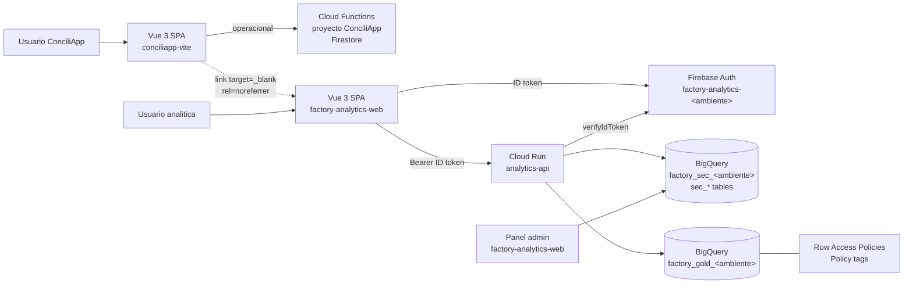

# Propuesta: sitio analitico independiente con enlace desde ConciliApp

## 1. Objetivo

Publicar el sitio analitico como un producto independiente en un proyecto
GCP propio (`factory-analytics-<ambiente>`), con su propia Firebase
Authentication, su propia API, sus propios secretos y su propia bitacora.
ConciliApp expone unicamente un enlace de menu hacia ese sitio; no comparte
identidad, tokens, custom claims, funciones ni Firestore con la plataforma
analitica.

Esta propuesta es complementaria a `PROPUESTA_DATA_LAKE_GCP.md`. No modifica
codigo del repositorio `conciliapp-vite` mas alla, opcionalmente, de una
entrada de menu con enlace externo. Define contratos, superficie visible al
usuario final y flujo de RLS aplicado dentro del proyecto analitico.

La decision de separar proyectos responde a que la organizacion no dispone
hoy de un IdP corporativo (SSO). Emitir credenciales analiticas desde el
mismo proyecto Firebase que ConciliApp mezclaria dos productos con dominios,
ciclos de vida, presupuesto y niveles de riesgo distintos, sin ganar
usabilidad real. Cuando exista un IdP corporativo, ambos productos podran
federarse a el, cada uno como Service Provider independiente.

## 2. Estado actual verificado en ConciliApp

Los siguientes elementos ya existen en `conciliapp-vite`. **No** se
reutilizan como fuente de identidad para el sitio analitico; se listan
porque son el patron de referencia que la API analitica replicara en su
propio contenedor, no un servicio compartido.

- **Verificacion de tokens Bearer** (`services/bff/src/apiGateway.ts`):
  `admin.auth().verifyIdToken`, whitelist `ALLOWED_ORIGINS`, rate limiting
  in-memory y filtrado por rol. La API analitica adoptara el mismo estilo
  apuntando al proyecto analitico, no a ConciliApp.
- **Reglas Firestore** (`firestore.rules`): funciones `hasRole`,
  `hasTenantAccess`, `hasCompanyAccess` muestran el estilo de RLS aceptado
  por el equipo. La API analitica implementara la misma disciplina en SQL
  sobre BigQuery.
- **Region de servicios** (`apps/web/src/firebase.ts`): las Cloud Functions
  de ConciliApp corren en `us-central1`. Este dato solo es relevante para
  dimensionar latencia percibida; no obliga a corregionalidad con la API
  analitica.
- **Vistas actuales de tablero** (`MetricsAnalyticsDashboard.vue`,
  `AnalystPanel.vue`, `VendedorDashboardResponsive.vue`): se mantienen sin
  cambios mientras el sitio nuevo cubra el caso analitico general. Su
  eventual retiro se planificara aparte.

Explicitamente **no** se reutilizaran desde ConciliApp:

- El proyecto Firebase de ConciliApp como IdP del sitio analitico.
- Los custom claims (`role`, `tenantId`, `empresas`, `sucursales`,
  `codVendedores`, `permissions`) como scope de BigQuery.
- Cloud Functions operativas (`services/bff`) como backend analitico.
- Firestore como catalogo de identidades analiticas o de `sec_principals`.

## 3. Principios de la separacion

- **Un proyecto GCP por producto.** ConciliApp opera en su proyecto actual;
  la analitica vive en `factory-analytics-<ambiente>`. IAM, presupuesto,
  bitacora, alertas y consola de Firebase son independientes.
- **Un IdP por producto.** La analitica emite sus propias credenciales
  desde su propia Firebase Authentication. No se emiten tokens cruzados,
  no se sincronizan custom claims entre proyectos y no se publica ningun
  topic Pub/Sub entre ConciliApp y el proyecto analitico.
- **Enlace, no integracion embebida.** ConciliApp muestra, si el negocio
  lo aprueba, una entrada de menu que abre el sitio analitico en pestana
  nueva con `rel="noreferrer noopener"`. El usuario autentica alli con las
  credenciales emitidas para analitica.
- **Cero credenciales de BigQuery en el navegador.** El SPA analitico
  solo habla con su propia API; nunca con BigQuery, Firestore u otros
  servicios directamente.
- **Provisioning gobernado.** `sec_principals` se administra dentro del
  proyecto analitico por el Data Steward, con altas explicitas y proceso
  documentado; no se deriva de eventos de otro proyecto.
- **Falla cerrada.** Un usuario sin `sec_principals` vigente o sin alcance
  aplicable recibe cero filas y un tablero vacio explicito, nunca un error
  que revele nombres de tablas o campos.
- **Compatibilidad futura con SSO.** Cuando exista un IdP corporativo, el
  proyecto analitico se conecta a el como Service Provider adicional, sin
  que eso obligue a modificar ConciliApp.

## 4. Arquitectura de integracion



Componentes clave:

- **Proyecto ConciliApp** (existente): sin cambios de backend. Como
  maximo, una entrada de menu en el SPA con enlace externo al dominio
  del sitio analitico. Ver §8.
- **Proyecto analitico** `factory-analytics-<ambiente>` (nuevo):
  - **Firebase Authentication propio.** Metodos habilitados: Google
    (OAuth) y email + password, ambos con MFA obligatorio para roles con
    acceso a datos personales o de alta sensibilidad.
  - **Firebase Hosting propio.** Publica el SPA `factory-analytics-web`
    en un subdominio dedicado (por ejemplo `analitica.<dominio>`).
  - **Cloud Run** `analytics-api` con cuenta de servicio de solo
    lectura sobre Gold y `sec_*`.
  - **BigQuery** con los datasets `factory_gold_<ambiente>`,
    `factory_sec_<ambiente>` y `factory_control_<ambiente>` definidos en
    la propuesta base.
  - **Panel administrativo** integrado al mismo SPA analitico (ruta
    protegida por rol `Admin`/`Steward` del proyecto analitico) para
    gestionar `sec_principals` y `sec_access_scopes`. Es el unico canal
    de alta y baja de usuarios analiticos en el MVP.
- **Sin canal automatico entre proyectos.** No hay Pub/Sub, no hay Cloud
  Functions cross-project, no hay tabla de equivalencia entre `tenantId`
  de ConciliApp y `source_empresa` del warehouse mantenida desde el lado
  operativo. Esa correspondencia vive en `sec_principals` como cualquier
  otro campo de identidad.

## 5. Identidad y provisioning sin SSO

Como la organizacion no dispone de un IdP corporativo, el proyecto
analitico administra su propio directorio dentro de Firebase
Authentication. Este es un compromiso conocido: cada usuario tendra un
password adicional que recordar, y las bajas dependeran de un proceso
interno en lugar de propagarse automaticamente desde RRHH. Esta seccion
define los controles que hacen tolerable ese compromiso.

### 5.1 Metodos de autenticacion

- **Google OAuth** para dominios corporativos aprobados. Es el metodo
  recomendado para usuarios internos con cuenta de Google Workspace;
  hereda la politica de contrasenas y MFA del dominio.
- **Email + password** para usuarios sin cuenta corporativa de Google.
  Politicas obligatorias en Firebase:
  - Verificacion de correo antes del primer acceso.
  - MFA (TOTP) obligatorio para todos los roles con acceso a Gold.
  - Longitud minima 12, sin reutilizacion, con deteccion de credenciales
    filtradas activada.
  - Bloqueo temporal por intentos fallidos y captcha en flujos de
    recuperacion.
- **Sin auto-registro publico.** La pantalla de login no ofrece "Crear
  cuenta". El alta se hace desde el panel administrativo tras aprobacion.

### 5.2 Roles del proyecto analitico

Los roles **no** se heredan de ConciliApp. Se definen dentro del
proyecto analitico via custom claims propios:

| Claim `role` (analitica)      | Uso                                                          |
| ----------------------------- | ------------------------------------------------------------ |
| `Admin`                       | Administra el proyecto analitico (usuarios, alcances).       |
| `Steward`                     | Gestiona `sec_principals` y `sec_access_scopes`.             |
| `AnalistaSenior`              | Acceso amplio a la rama comercial y de producto autorizada.  |
| `Analista`                    | Empresas y sucursales autorizadas; sin datos personales por defecto. |
| `Vendedor`                    | Solo sus codigos de vendedor y rutas autorizadas.            |
| `GerenteProveedor`, `AnalistaProveedor`, `CoordinadorProveedor` | Actores externos (ver §14). |

Los custom claims analiticos son minimos: `role`, `partnerId` (solo
externos), `status`. Todo el alcance efectivo (empresas, sucursales,
vendedores, rutas, marcas) vive en `sec_access_scopes` y se resuelve en
la API en cada peticion. Esto evita reemitir tokens en cada cambio de
alcance.

### 5.3 Provisioning inicial (bootstrap)

1. El Data Steward exporta la lista aprobada de usuarios (correo, rol,
   alcance solicitado) desde ConciliApp u otra fuente autoritativa
   corporativa. No hay conexion automatica entre sistemas.
2. Carga la lista en el panel administrativo del sitio analitico como
   CSV firmado por el aprobador (Data Owner).
3. El panel crea usuarios via Admin SDK en el proyecto analitico, envia
   invites con contrasena temporal o vinculacion a Google, y escribe la
   fila correspondiente en `sec_principals` y `sec_access_scopes` en
   estado `pending_first_login`.
4. En el primer acceso el usuario completa MFA. La fila pasa a `active`
   automaticamente.

### 5.4 Provisioning continuo

- **Altas y bajas manuales.** El propietario del area solicita al Data
  Steward la creacion o desactivacion. La solicitud queda registrada en
  `sec_access_audit` con aprobador, motivo y fecha de expiracion.
- **Sin sincronizacion desde ConciliApp.** Un usuario que pierde su
  cuenta de ConciliApp no pierde automaticamente su acceso analitico y
  viceversa. La revision cruzada se hace en la recertificacion.
- **Recertificacion.** Trimestral para usuarios internos, mensual para
  externos, comparando la lista de `sec_principals` activos contra las
  listas autoritativas provistas por RRHH y por el propietario del
  proveedor. Los usuarios no recertificados se suspenden.
- **Baja inmediata.** El Data Steward tiene un flujo de un clic:
  desactivar en Firebase Auth + `admin.auth().revokeRefreshTokens(uid)`
  + `sec_principals.status = 'revoked'`. Todo el efecto ocurre dentro
  del proyecto analitico.
- **Alerta de staleness.** Un job diario verifica que `sec_principals`
  haya sido revisado al menos una vez por trimestre para cada activo;
  los que superen el umbral se marcan `stale` y quedan sin datos hasta
  que el Steward los revalide.

### 5.5 Camino futuro hacia SSO

Cuando la organizacion adopte un IdP corporativo:

- El proyecto analitico habilitara ese IdP como proveedor SAML u OIDC en
  Firebase Authentication (Identity Platform / GCIP si se requiere
  multi-tenancy).
- Las cuentas email + password existentes se migran progresivamente: el
  mismo correo, autenticado ahora contra el IdP corporativo, resuelve al
  mismo `sec_principals`.
- Los custom claims analiticos y `sec_*` no cambian; solo cambia el
  metodo de autenticacion.
- ConciliApp podra adoptar el mismo IdP como Service Provider
  independiente, sin que eso obligue a rediseno del sitio analitico.

Esta trayectoria evita rehacer el modelo de alcance cuando aparezca el
IdP; solo se sustituye la capa de autenticacion.

## 6. Flujo de peticion analitica

1. El SPA analitico ejecuta `getIdToken()` sobre el usuario Firebase del
   proyecto analitico. No se crean tokens propios ni se firman JWT en el
   frontend.
2. La peticion viaja a `analytics-api` con `Authorization: Bearer
   <id_token>` y el origen del sitio (`analitica.<dominio>` o
   `localhost` en desarrollo).
3. La API valida:
   - `verifyIdToken` contra el proyecto Firebase analitico.
   - Que el `aud` coincida con el project ID configurado por ambiente.
   - Que el claim `role` del proyecto analitico este en la lista
     permitida para el endpoint.
   - Que la sesion no este marcada como revocada
     (`checkRevoked = true`).
4. Consulta `sec_principals` por `email` normalizado. Si no existe o
   esta inactivo, responde `204 No Content` con cero filas; nunca `404`
   con detalle.
5. Resuelve `sec_access_scopes` vigentes para el usuario. Las ramas de
   producto y comercial se combinan con interseccion; un scope vencido
   no aporta filas.
6. Construye el filtro SQL a Gold agregando predicados por
   `source_empresa`, `cod_sucursal`, `codigo_vendedor`, `producto_key`,
   `territorio_key` segun corresponda. Ningun endpoint acepta filtros
   que amplien el alcance; solo pueden reducirlo.
7. Ejecuta la consulta con la cuenta de servicio `sa-factory-bi` con
   `maximum_bytes_billed` y `labels` para atribucion de costo.
8. Cachea el resultado con TTL corto (5-60 min segun endpoint) y clave
   `hash(user_scope + query_id + params)`. La cache se invalida al
   publicar Gold.
9. Devuelve JSON agregado al SPA. Datos sensibles marcados con policy
   tag se responden ya enmascarados por BigQuery.

Ningun endpoint expondra SQL parametrizable por el cliente. La API
acepta unicamente `dashboard_id`, `filtros` tipados y `rango_fecha` del
catalogo autorizado, siguiendo el patron ya validado por
`services/bff/src/eFactorySobres.ts` en ConciliApp (referencia de estilo,
no dependencia de codigo).

## 7. Contrato de `sec_principals` y auditoria

`sec_principals` es el registro autoritativo de identidades analiticas y
vive dentro del proyecto analitico. Su contenido es el unico que
determina si un usuario ve datos.

Columnas minimas:

| Columna              | Origen                                                |
| -------------------- | ----------------------------------------------------- |
| `email`              | Correo normalizado (lowercase, trimmed), unico.       |
| `firebase_uid`       | UID del proyecto analitico.                           |
| `type`               | `internal` o `partner`.                               |
| `partner_id`         | Solo para externos; codigo del proveedor.             |
| `role`               | Claim analitico (`Admin`, `Steward`, `Analista`, ...). |
| `status`             | `pending_first_login`, `active`, `suspended`, `revoked` o `stale`. |
| `created_by`         | Correo del Steward que aprobo el alta.                |
| `created_at`         | Timestamp UTC.                                        |
| `last_reviewed_at`   | Ultima recertificacion.                               |
| `expires_at`         | Fecha maxima de vigencia (obligatoria para externos). |
| `source_of_truth`    | Referencia al documento o CSV que autorizo el alta.   |

Reglas:

- `sec_principals` no se llena mediante triggers automaticos desde
  ConciliApp, RRHH ni sistemas externos en el MVP. Toda escritura
  proviene del panel administrativo del sitio analitico.
- Toda escritura genera una fila en `sec_access_audit` con actor,
  operacion, motivo, y valores previo y nuevo. La bitacora es
  append-only.
- Las bajas se propagan al mismo tiempo a Firebase Authentication
  (`disable` + `revokeRefreshTokens`) y a `sec_principals.status =
  'revoked'`. La API ya no encontrara al usuario en la siguiente
  peticion, sin depender de la expiracion natural del token.
- Una alerta operativa dispara cuando `sec_principals.status = 'active'`
  supera N dias sin `last_reviewed_at` (default: 90 para internos, 30
  para externos). La alerta llega al canal del Data Steward.

## 8. Superficie de integracion en ConciliApp

El cambio en `conciliapp-vite` se limita a **un solo elemento opcional**:
una entrada de menu que enlaza al sitio analitico. Nada mas.

### 8.1 Cambio propuesto

En el menu principal (o donde el equipo de UX considere adecuado),
agregar un enlace externo:

```html
<a
  href="https://analitica.<dominio>"
  target="_blank"
  rel="noreferrer noopener"
>
  Ir a Analitica
</a>
```

Notas:

- `rel="noreferrer noopener"` evita filtrar el URL de origen y protege
  contra `window.opener` en la pestana destino.
- **No** se inyecta ningun token, correo ni claim en el URL. El usuario
  autentica de nuevo en el sitio analitico con las credenciales
  emitidas para ese proyecto.
- El enlace puede condicionarse por rol de ConciliApp (por ejemplo,
  visible solo para `Admin`, `Master` o `Analista`), pero eso es una
  decision cosmetica; no otorga acceso analitico por si sola.

### 8.2 Cambios explicitamente descartados

- **Sin composables** ni `useAnalyticsApi`; sin `fetch` desde el SPA
  operativo hacia la API analitica.
- **Sin cambios en `apps/web/src/firebase.ts`** ni en variables de
  entorno `VITE_*` mas alla del URL del enlace.
- **Sin cambios en `services/bff`**: ninguna Cloud Function nueva,
  ninguna publicacion Pub/Sub, ninguna modificacion a
  `setCustomUserClaims` ni a `apiGateway.ts`.
- **Sin sincronizacion de usuarios** desde `auth.user().onCreate` /
  `.onDelete`.
- **Sin iframe embebido** del sitio analitico dentro de ConciliApp.
  Cargar contenido de otro origen que emite tokens propios en un iframe
  produce problemas conocidos de cookies SameSite, sesion y
  clickjacking; se descarta.
- **Sin edicion de `firestore.rules`** ni acceso a datasets analiticos
  desde ConciliApp.

### 8.3 Consecuencia operativa

Los universos de usuarios analiticos y operativos se administran por
separado. Puede haber:

- personas presentes en ambos con credenciales distintas;
- personas solo en ConciliApp;
- personas solo en analitica (analistas, direccion, externos);
- personas que se dan de baja en uno sin dar de baja en el otro (se
  detecta en la recertificacion cruzada).

Este costo es intencional. Simplifica IAM, elimina el riesgo de que un
cambio en ConciliApp otorgue silenciosamente acceso a Gold, y evita el
patron mas fragil de RLS con Firebase (`sec_principals` desactualizado
por sincronizacion cross-project).

## 9. Consideraciones de seguridad

- **Sesion**: la API analitica respetara `exp` del token de Firebase y
  ejecutara `checkRevoked = true` para reaccionar en horas ante bajas.
  Duracion de sesion sugerida: 4 h, alineada al patron ya en uso en
  ConciliApp (`SESSION_DURATION_MS`), pero configurable dentro del
  proyecto analitico.
- **CORS**: whitelist estricta por ambiente. No usar `*`. La lista se
  mantiene en el repositorio del sitio analitico; el dominio de
  ConciliApp no aparece en ella porque nunca llama a la API analitica.
- **Rate limiting**: mismo patron `checkRateLimit` de `apiGateway.ts`
  (in-memory por instancia; migrar a Memorystore si crece el numero de
  instancias). Limites separados por usuario autenticado y por endpoint
  costoso.
- **Errores**: mensajes genericos (`Error interno del servidor`) sin
  exponer nombres de tablas, columnas ni consultas. Detalle en Cloud
  Logging correlacionado con `trace_id`.
- **Datos personales**: RIF, direccion y GPS marcados con policy tags.
  Un rol `Analista` sin permiso `analitica.datos_sensibles` recibe los
  campos enmascarados por BigQuery, no filtrados en la API. Esto elimina
  la clase de fugas por lookup inverso desde el frontend.
- **Auditoria**: cada peticion analitica escribe en la bitacora un
  evento con `email`, `dashboard_id`, `scope_hash`, `bytes_procesados` y
  `latencia`. La bitacora vive en el proyecto analitico; no se comparte
  con `bitacora.ts` de ConciliApp.
- **Secretos**: la API analitica no consume secretos de ConciliApp.
  Cualquier secreto propio se guarda en Secret Manager del proyecto
  analitico y se declara con `defineSecret` en el contenedor.
- **Firebase App Check**: obligatorio en el SPA analitico. Reduce
  significativamente el abuso de la API desde clientes no autorizados y
  es especialmente relevante en el perfil externo (§14).

## 10. Costos y desempeno

- **Latencia**: si Cloud Functions operativas siguen en `us-central1`, la
  region de BigQuery y la region de Cloud Run analitico deben quedar en la
  misma ubicacion o en `us-central1`/`us-multi-region` para minimizar
  latencia perceptible al usuario final. Esto se confirmara en la fase 0
  con una prueba corta.
- **Cache**: TTL por endpoint. Los KPIs de portada admiten 15-60 min; los
  detalles interactivos, 1-5 min. La cache se invalida al publicar Gold.
- **Bytes procesados**: `maximum_bytes_billed` por endpoint. Los tableros
  criticos apuntan a agregados materializados en Gold, no a `fact_ventas`
  directo.
- **Egress**: la respuesta JSON al navegador es egress facturable; los
  agregados suelen ser pequenos (<50 KB), pero se medira en el piloto.

## 11. Fases de trabajo

1. **Diseno detallado** (esta propuesta + acuerdo con Data Owner y
   Seguridad): matriz inicial de dashboards, catalogo de roles
   analiticos, dominio y politica de MFA, formato del CSV de bootstrap.
2. **Fundacion analitica**: crear proyecto GCP
   `factory-analytics-<ambiente>`, habilitar Firebase Authentication,
   Firebase Hosting y App Check; crear cuentas de servicio, datasets
   `factory_sec_<ambiente>`, `factory_gold_<ambiente>` y tablas `sec_*`
   con Terraform.
3. **Panel administrativo MVP**: modulo del SPA analitico protegido por
   rol `Admin`/`Steward` que permita alta, edicion, suspension y
   revocacion de usuarios, con escritura en Firebase Auth y en
   `sec_principals`.
4. **API analitica MVP**: un unico endpoint `GET /dashboards/:id` que
   valide token, resuelva scopes desde `sec_*` y retorne un agregado
   plano. Sin cache, sin dashboards multiples.
5. **SPA analitico MVP**: sitio Vue 3 + Vite publicado en Firebase
   Hosting del proyecto analitico, con login, MFA obligatorio, un
   dashboard base y el panel administrativo.
6. **Bootstrap de usuarios**: cargar el CSV inicial firmado por el Data
   Owner y ejecutar pruebas de RLS positivas y negativas por rol.
7. **RLS extendido**: sumar dimensiones proveedor, marca, territorio y
   ruta mediante `sec_*` gestionado por el Data Steward; habilitar
   dashboards adicionales.
8. **Perfil externo (opcional segun demanda)**: aplicar §14. Puede
   coincidir con el mismo proyecto analitico con separacion logica o
   requerir un segundo proyecto GCP dedicado; ver criterios en §14.1.
9. **Enlace desde ConciliApp**: agregar la entrada de menu descrita en
   §8, condicionada al rol interno correspondiente.
10. **Endurecimiento**: policy tags, dynamic masking, App Check,
    alertas de staleness, pruebas sinteticas de RLS por actor.
11. **Adopcion**: comunicar el nuevo acceso, retirar tableros ad hoc
    previos y activar recertificacion trimestral y mensual segun
    aplique.

## 12. Criterios de aceptacion

- Un usuario autenticado en el sitio analitico consulta datos solo si
  tiene una fila `active` en `sec_principals` del proyecto analitico.
- Un usuario existente en ConciliApp que no exista en `sec_principals`
  no obtiene datos, aun si intenta acceder al dominio del sitio
  analitico mientras tiene sesion en ConciliApp.
- El SPA analitico jamas hace consultas a BigQuery, Firestore u otros
  servicios directamente; solo consume la API analitica.
- La API analitica jamas responde datos fuera del alcance calculado,
  aun ante peticiones manipuladas por el cliente.
- Un cambio de rol o alcance hecho en el panel administrativo se
  refleja en la siguiente peticion, sin esperar la expiracion del token
  (`checkRevoked = true`).
- Los mensajes de error son genericos y los detalles quedan en Cloud
  Logging, correlacionados con `trace_id`.
- La bitacora registra al menos: `email`, `dashboard_id`, `scope_hash`,
  `latencia`, `bytes_procesados`. La conservacion sigue la politica
  aprobada del proyecto analitico.
- MFA obligatorio en todos los roles con acceso a Gold; el panel
  administrativo aplica MFA sin excepciones.
- La entrada de menu en ConciliApp (si se implementa) usa
  `rel="noreferrer noopener"` y no transporta tokens ni datos personales
  en el URL.
- No existe ningun canal automatico de sincronizacion de usuarios,
  claims o eventos entre el proyecto Firebase de ConciliApp y el
  proyecto analitico.

## 13. Riesgos y mitigaciones

- **Fatiga de credenciales.** Usuarios que ya inician sesion en
  ConciliApp deberan iniciar sesion aparte en analitica. Se mitiga
  favoreciendo Google OAuth cuando exista cuenta corporativa y con la
  ruta futura hacia SSO descrita en §5.5.
- **Doble mantenimiento de identidades.** La recertificacion cruzada de
  ConciliApp vs analitica es manual en el MVP. Se mitiga con la alerta
  de staleness sobre `last_reviewed_at` y con la exportacion periodica
  del roster de ConciliApp como insumo (no fuente) para el Steward.
- **Provisioning manual vulnerable a error humano.** Un CSV mal firmado
  puede abrir accesos indebidos. Se mitiga con doble aprobacion (Data
  Owner y Steward) y con pruebas automaticas de RLS ejecutadas tras
  cada carga masiva.
- **Fugas por columnas no enmascaradas.** Se mitiga con policy tags
  desde staging y pruebas sinteticas por actor.
- **Costos runaway.** Se mitiga con `maximum_bytes_billed`, cache por
  endpoint y alertas de presupuesto por proyecto analitico.
- **Confusion de dominios.** Un usuario puede intentar sus credenciales
  de ConciliApp en analitica. Se mitiga con mensajes de login claros y
  con dominios distintos (`analitica.<dominio>` vs el dominio operativo).
- **Ausencia futura de SSO.** Si el IdP corporativo tarda en llegar, la
  base de usuarios crecera y el mantenimiento manual se volvera pesado.
  Se mitiga limitando el crecimiento inicial a usuarios con necesidad
  demostrada y priorizando la adopcion de Google OAuth.

## 14. Actores externos (proveedores)

Los usuarios externos (gerente, analista y coordinador de proveedor
descritos en la propuesta base) son la fuente de riesgo mas alta del
sistema: son terceros con acceso a informacion de ventas que puede
identificar competidores, clientes y estrategia comercial. Reciben un
tratamiento distinto al de los usuarios internos del sitio analitico y
al de los usuarios operativos de ConciliApp; no comparten proyecto
Firebase, superficie web ni Cloud Run con ninguno de los dos.

### 14.1 Aislamiento por diseno

Se recomienda un tercer proyecto GCP dedicado, distinto tanto de
ConciliApp como del proyecto analitico interno. El aislamiento se hace
desde el nivel de proyecto GCP, no solo desde reglas de aplicacion:

- **Proyecto Firebase dedicado** `factory-analytics-partners-<ambiente>`,
  con su propio Authentication, su propia consola y sus propios
  administradores. Ninguna Cloud Function operativa de ConciliApp ni de
  la analitica interna esta desplegada en ese proyecto.
- **SPA externo separado** publicado en Firebase Hosting bajo un
  dominio propio (por ejemplo `partners.<dominio-corporativo>`), con su
  propia `apiKey` publica, su propia whitelist de origenes y su propio
  `authDomain`. Puede compartir monorepo con el SPA analitico interno,
  pero se compila y despliega como aplicacion independiente para evitar
  que un bundle con rutas internas quede accesible tras un cambio de
  router.
- **Superficies internas vedadas.** El SPA externo no incluye el SDK de
  Firestore de ConciliApp ni el SDK del proyecto analitico interno.
  Solo habla con la API analitica externa. Aunque un atacante manipule
  el bundle, no puede invocar `httpsCallable` a funciones internas
  porque la identidad proviene de otro proyecto Firebase.
- **Instancia separada de la API analitica.** Se despliega un servicio
  Cloud Run `analytics-api-partners` en la misma region que la API
  interna, con su propia cuenta de servicio (`sa-factory-bi-partners`) y
  su propia lista de endpoints. Comparte codigo con la API interna via
  imagen versionada, pero corre con configuracion propia y presupuesto
  propio.
- **Dataset o vistas dedicadas.** Sobre `factory_gold_<ambiente>` se
  crean vistas autorizadas `factory_gold_partners_<ambiente>` que
  proyectan solo las columnas admisibles para externos y aplican las
  reglas de agregacion minima. La API `analytics-api-partners` consulta
  unicamente esas vistas; nunca las tablas base.

La razon del proyecto separado es que un incidente comun (una regla
mal escrita, un guard de router debil, un `console.log` accidental)
deja de ser una fuga inter-organizacional. Un usuario de un proveedor
no puede consultar Firestore de ConciliApp ni BigQuery del proyecto
analitico interno aunque quisiera, porque su token no lo firman los
proyectos que esos servicios reconocen.

Si el negocio decide en el futuro consolidar externos en el mismo
proyecto analitico interno usando Identity Platform multi-tenancy
(GCIP), la migracion es posible pero debera pasar antes por una
revision de seguridad especifica y ampliar las pruebas sinteticas de
RLS a los casos de cruce entre tenants. En el MVP no se recomienda esa
consolidacion.

### 14.2 Identidad y provisioning

- **Dominios permitidos por proveedor.** Cada proveedor declara los
  dominios de correo autorizados (`@kraft-heinz.com`, por ejemplo). La
  Cloud Function `beforeCreate` (Auth Blocking Function del proyecto
  externo) rechaza cualquier alta cuya direccion no coincida con la
  whitelist vigente del proveedor. Sin excepciones inline: una excepcion
  se registra en `sec_external_entitlements` con aprobador.
- **Sin auto-registro abierto.** El alta pasa por un flujo administrativo
  en el que el propietario interno del proveedor (definido en la
  propuesta base) confirma nombre, cargo, dominio, motivo, fecha de
  expiracion y proveedor. Solo entonces se envia el invite. No existe un
  boton publico de "Registrarme".
- **Federacion opcional con IdP del proveedor.** Si un proveedor grande
  aporta su propio SAML/OIDC, se agrega como IdP en el proyecto Firebase
  externo (por ejemplo mediante GCIP). Esto elimina passwords en el
  perimetro corporativo y da al proveedor control sobre sus altas y
  bajas.
- **MFA obligatorio.** El proyecto externo aplica MFA (SMS y/o TOTP)
  sobre todo el dominio, no solo sobre admins. Un proveedor que se niegue
  a MFA no se incorpora.
- **Sin claims operativos.** Los usuarios externos no reciben `tenantId`,
  `empresas`, `sucursales` ni `codVendedores` de ConciliApp. En su lugar
  llevan claims limitados:

  ```text
  role              'GerenteProveedor' | 'AnalistaProveedor' | 'CoordinadorProveedor'
  partnerId         codigo estable del proveedor (p.ej. 'KRAFT')
  contractId        contrato vigente
  contractExpiresAt fecha de expiracion en ISO-8601
  status            'active' | 'suspended' | 'revoked'
  ```

  El `partnerId` es la unica dimension que el token propaga; todo lo
  demas (marcas, empresas contratadas, SKU, umbrales de k-anonimato) se
  resuelve en `sec_external_entitlements`. Esto evita que un cambio de
  contrato requiera reemitir claims a cientos de usuarios.

### 14.3 Modelo RLS para externos

El aislamiento logico se hace sobre `sec_external_entitlements` y las
vistas de la propuesta base, no se deriva del token.

- **Filtro base obligatorio.** Cada endpoint de
  `analytics-api-partners` recibe el `partnerId` del token y consulta
  `sec_external_entitlements` para obtener la lista vigente de
  `(source_empresa, codigo_marca)` autorizada. Ese par se agrega como
  predicado a la consulta contra Gold. Un cambio de contrato se refleja
  inmediatamente sin tocar Firebase.
- **Interseccion con permisos concedidos por steward.** Los alcances
  registrados en `sec_access_scopes` (por proveedor o marca) actuan como
  restriccion adicional; nunca amplian el contrato. Un scope que
  contradiga el contrato se ignora y se registra en `sec_access_audit`.
- **Cero acceso a la rama comercial.** Los externos no reciben
  `territorio`, `ruta`, `vendedor` ni `cliente_comercial` en sus vistas.
  Un tablero que necesite esa rama no se expone al perfil externo, aunque
  el proveedor lo pida.
- **k-anonimato por celda.** Las vistas `factory_gold_partners_*` fuerzan
  un umbral minimo (inicial: k >= 5) sobre cada agregado por combinacion
  visible. Celdas con menos observaciones se enmascaran con un valor
  centinela (`n_lt_k`), no se ocultan silenciosamente ni se redondean.
  Los tableros muestran ese centinela explicitamente para que el usuario
  entienda que la muestra es insuficiente.
- **Sin exportacion masiva.** La API externa no ofrece endpoints de
  descarga cruda. La descarga se limita a agregados ya visibles en
  pantalla, con marca de agua textual (usuario, fecha, proveedor,
  numero de hoja). Ninguna respuesta contiene mas filas de las que el
  tablero mostraria.
- **Cero datos personales.** RIF, cedula, nombre de vendedor y de
  cliente, GPS y direccion se declaran con policy tags de acceso denegado
  para las cuentas de servicio de la API externa. Aunque un endpoint
  intentara seleccionarlos, BigQuery los devolveria enmascarados.
- **Bitacora granular por peticion.** Cada llamada registra `partnerId`,
  `email`, `dashboard_id`, `filtros`, `celdas_devueltas`,
  `celdas_enmascaradas_por_k`, `bytes_procesados` y `trace_id`. La
  bitacora se guarda al menos el plazo contractual, para poder demostrar
  el uso ante el proveedor si surge una disputa.

### 14.4 Ciclo de vida contractual

El acceso externo esta atado al contrato, no a la persona. La
sincronizacion `sec_principals` externa integra estos disparadores:

1. **Alta:** el propietario del proveedor crea la solicitud;
   `sec_external_entitlements` recibe la fila con `valid_from` y
   `valid_to` obligatorios. Solo cuando esa fila existe, la Auth Blocking
   Function permite el registro del usuario.
2. **Suspension temporal:** el propietario o el equipo de seguridad
   marca el contrato como `suspended`. El siguiente refresh de token
   verifica el estado (`checkRevoked=true`) y el usuario queda sin datos
   en horas. No se elimina el usuario; se restaura al reactivar.
3. **Revocacion:** al terminar el contrato se ejecuta
   `admin.auth().revokeRefreshTokens(uid)` en el proyecto externo y se
   marca `sec_principals.status = 'revoked'`. Adicionalmente se
   deshabilita la cuenta.
4. **Expiracion automatica.** Un job diario recorre
   `sec_external_entitlements` y aplica los pasos 2 y 3 sobre contratos
   cuya `valid_to` haya pasado. Esto evita que una salida no comunicada
   deje sesiones activas.
5. **Recertificacion obligatoria.** Cada mes el propietario del proveedor
   confirma que la lista de usuarios y de contratos vigente sigue
   siendo correcta. Si no confirma en el plazo, el sistema suspende el
   acceso hasta que lo haga. Esta politica es intencionadamente
   agresiva: la ausencia de confirmacion no debe ser una autorizacion
   implicita.
6. **Baja de la persona por parte del proveedor.** Se comunica por
   canal formal (correo o portal), se procesa el mismo dia y queda
   registrada en `sec_access_audit` con motivo.

Un evento comun que se debe cubrir explicitamente es el traspaso interno
del proveedor (una persona cambia de rol dentro de la misma empresa). Se
trata como baja del acceso anterior y solicitud nueva, no como
"reasignacion" silenciosa. Esto impide que privilegios crezcan por
acumulacion.

### 14.5 Prevencion de identificacion indirecta

Un proveedor con acceso "solo a su marca" puede inferir informacion de
la competencia si los tableros incluyen contexto de mercado. Esta
propuesta obliga a estos controles en la vista de externos:

- **Sin comparaciones de mercado por defecto.** Las comparaciones entre
  proveedores requieren aprobacion escrita del Data Owner y auditoria
  particular. Si se aprueban, se entregan solo agregados sujetos al
  umbral `k`.
- **Sin ranking absoluto.** No se muestran posiciones ni indices que
  permitan inferir el desempeno de otro proveedor (por ejemplo, "usted
  ocupa el 3.er lugar de 8").
- **Sin totales de sucursal si k no se cumple.** Los tableros no
  desglosan por sucursales con volumen bajo. En su lugar agregan a
  region o codigo de grupo hasta cumplir `k`.
- **Sin campos derivados que revelen competidores.** Metricas como
  "participacion en el estante" o "share vs categoria" se calculan en
  Gold ya redondeadas y sin fila por competidor.
- **Sin cross-join libre entre marcas y clientes.** El usuario no puede
  cruzar en el frontend marca X con cliente Y para un proveedor Z si
  ese cruce revelaria la venta directa de un competidor.

### 14.6 Superficie tecnica adicional

Frente al plan interno, la variante externa agrega estos entregables.
Ninguno se ejecuta en esta propuesta; se documenta para dimensionar:

- Proyecto GCP `factory-analytics-partners-<ambiente>` con Firebase
  habilitado, Auth Blocking Functions, App Check y MFA.
- SPA `partners-web` empaquetado por separado, con su propia
  configuracion y bundle. Comparte componentes ECharts con el SPA
  analitico interno, pero no importa router interno ni composables
  operativos.
- Servicio Cloud Run `analytics-api-partners` con cuenta de servicio
  propia y acceso unicamente a `factory_gold_partners_<ambiente>`.
- Dataset `factory_gold_partners_<ambiente>` con vistas autorizadas
  materializadas o virtuales (definir en el diseno detallado segun
  costo de consulta).
- Job de sincronizacion `sync-partner-principals` independiente del
  interno, que integra la Auth Blocking Function y la reconciliacion.
- Portal minimo de administracion externa para el propietario del
  proveedor (alta, baja, recertificacion). Puede ser una vista privada
  del SPA analitico interno, expuesta unicamente a roles `Admin` y
  `Steward` del proyecto analitico; **no** vive en ConciliApp ni en el
  SPA externo.

### 14.7 Criterios de aceptacion adicionales

- Un usuario externo autenticado en
  `factory-analytics-partners-<ambiente>` no puede invocar ninguna
  funcion, ni leer ningun documento, del proyecto operativo de
  ConciliApp ni del proyecto analitico interno, aunque conozca sus
  URLs.
- Un usuario externo sin `sec_external_entitlements` vigente recibe cero
  filas, aunque su cuenta este activa.
- Cambiar `partnerId` en el claim manualmente en el cliente no altera el
  alcance; la API lo re-verifica desde `sec_external_entitlements` en
  cada peticion.
- Un contrato expirado devuelve cero filas dentro de las 24 horas del
  cambio de estado y revoca las sesiones activas en horas, no dias.
- Ninguna respuesta al SPA externo incluye RIF, cedula, GPS, direccion,
  ni nombre de vendedor/cliente. Se verifica con pruebas automatizadas
  sobre respuestas capturadas.
- Los agregados con `n < k` aparecen como `n_lt_k`, nunca como cero
  aparente. Se verifica con pruebas de vistas.
- La bitacora externa demuestra por dia: quien consulto, que dashboard,
  con que filtros, cuantas celdas se enmascararon por `k` y cuantos
  bytes se procesaron.
- La recertificacion mensual se aplica: usuarios cuyo contrato no fue
  recertificado a tiempo aparecen suspendidos hasta que el propietario
  confirme.

## 15. Preguntas abiertas

1. Dominio y subdominio deseados para el sitio analitico
   (`analitica.<dominio>`, `bi.<dominio>`, `factory-analytics.app`,
   otro).
2. Repositorio del SPA analitico: nuevo repo independiente
   (`factory-analytics-web`, recomendado) o segunda app en el monorepo
   `conciliapp-vite`. Se recomienda repo independiente porque el
   proyecto GCP es distinto y los pipelines, secretos e IAM tambien lo
   son.
3. Metodos de autenticacion habilitados en el proyecto analitico: solo
   Google, solo email + password o ambos. En el MVP se sugiere ambos,
   con MFA obligatorio.
4. Responsable operativo del panel administrativo (Data Steward) y su
   suplente. La rotacion es tan critica como cualquier acceso Admin.
5. Politica de MFA: TOTP solamente (recomendado) o TOTP + SMS como
   respaldo (menos seguro, mas conveniente).
6. Umbral `k` de anonimato aceptable comercialmente para las vistas de
   proveedor. Valor inicial sugerido: 5.
7. Plazo minimo de retencion de `sec_access_audit` exigido por
   contratos, legal o auditoria interna.
8. Ubicacion aceptada para BigQuery a nivel legal y contractual: Sur
   America, Estados Unidos o multi-region.
9. Perfil externo: se aloja en el mismo proyecto analitico interno con
   separacion logica (Identity Platform multi-tenancy) o se crea un
   proyecto GCP dedicado `factory-analytics-partners-<ambiente>`? Se
   recomienda proyecto dedicado; criterios en §14.1.
10. Cuando exista un IdP corporativo (SAML/OIDC), sera el mismo IdP el
    que federe ConciliApp y analitica, o cada uno tendra el suyo?

Las respuestas se incorporaran al documento de diseno detallado del MVP
antes de comenzar la fase 2 de la implementacion.
