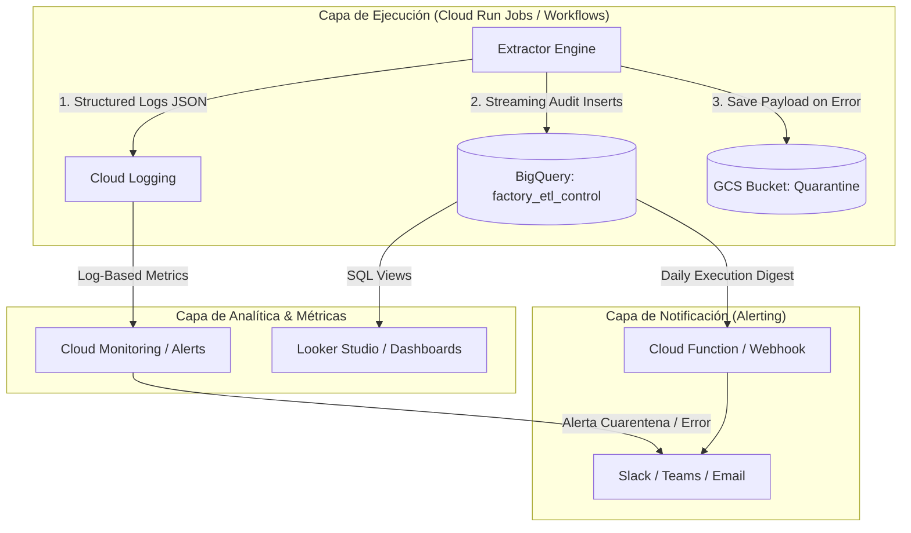

# 📡 Estrategia Recomendada de Observabilidad, Logging y Notificaciones (`factory-etl`)

Para garantizar **visibilidad en tiempo real, trazabilidad de auditoría y respuesta rápida ante fallos/cuarentenas** en el entorno GCP de `factory-etl`, se recomienda implementar un enfoque **Serverless & Event-Driven** nativo en Google Cloud.

---

## 🏗️ 1. Arquitectura de Observabilidad y Alertas

---

## 📊 2. Estrategia por Capas

### A. Logging Estructurado (Cloud Logging)
- **Formato:** Todos los logs emitidos a `stdout` se deben formatear como **JSON Estructurado** compatible con Google Cloud Logging (`severity`, `component`, `run_id`, `source_empresa`, `entity`, `status`, `quarantine_reason`).
- **Niveles de Severidad:**
  - `INFO`: Inicio/fin de corrida, batches escritos exitosamente en Bronze, skips por deduplicación.
  - `WARNING`: Discrepancias leves (ej. `SCHEMA_DRIFT` por columnas adicionales).
  - `ERROR`: Lotes enviados a **Cuarentena** (`SCHEMA_MISMATCH`, `EMPTY_REJECTED`) o errores HTTP con reintento agotado.
  - `CRITICAL`: Fallos de autenticación global, caída de conexión a eFactory o falla completa del Job/Workflow.

### B. Auditoría y Métricas (BigQuery `factory_etl_control`)
Aprovechar las 3 tablas de control ya implementadas (`etl_runs`, `etl_batches`, `etl_events`):
- **Vistas Materializadas / Consultas clave:**
  - **% Éxito Operativo:** `COUNT(status = 'success') / COUNT(total_batches)` por día y por empresa.
  - **Tasa de Cuarentena:** Batches desviados a la tabla/bucket de cuarentena.
  - **Latencia API eFactory:** Tiempo promedio de respuesta HTTP por empresa y entidad.

### C. Sistema de Notificaciones en Tiempo Real (Alerting)

Se recomiendan **dos modalidades de notificación**:

#### 1. Alertamiento Inmediato (Event-Driven / Crítico)
- **Disparador:** Un lote es enviado a **Cuarentena** (`QUARANTINED`) o la corrida completa falla (`FAILED`).
- **Mecanismo:**
  - **Opción A (Recomendada - Cloud Monitoring + Webhook):** Filtro en Cloud Logging para `jsonPayload.status = "quarantined"` o `severity = "ERROR"`. Cloud Monitoring activa una notificación inmediata vía Webhook a **Slack / Microsoft Teams / PagerDuty**.
  - **Opción B (Eventarc / Cloud Function):** Notificación disparada cuando se crea un objeto en `gs://factory-etl-dev-0y1dhf-quarantine`.
- **Contenido del Mensaje (Slack/Teams Card):**
  > 🚨 **ALERTA: Lote en Cuarentena Detectado**
  > - **Empresa:** `daroan`
  > - **Entidad:** `ventas_diarias_v1`
  > - **Fecha Lote (`dt`):** `2026-01-31`
  > - **Razón:** `SCHEMA_MISMATCH` (Payload HTML devuelto por eFactory)
  > - **Run ID:** `4dc66876-9476-4fa5-8355-e865a15271b4`
  > - 🔗 [Ver Payload en GCS](https://console.cloud.google.com/storage/browser/factory-etl-dev-0y1dhf-quarantine)

#### 2. Informe Sintético Diario (Daily Digest / Executive Summary)
- **Disparador:** Al finalizar la ejecución del orquestador diario (`Cloud Workflows`).
- **Mecanismo:** Un paso final en el Workflow envía un payload consolidado a una Cloud Function o Webhook de canal general.
- **Contenido del Mensaje:**
  > ✅ **Resumen Ejecutivo ETL Diario (`factory-etl`)**
  > - **Estado:** `SUCCEEDED` (100% de Éxito)
  > - **Lotes Procesados:** 95 / 95 exitosos
  > - **Cuarentena / Errores:** 0
  > - **Duración Total:** `9.8 min`
  > - **Registros Cargados a Bronze:** `142,580 filas`

---

## 🛠️ 3. Plan de Implementación Sugerido

1. **Fase 1 (Inmediata - Sin costo extra):**
   - Configurar la emisión de logs JSON en `src/factory_etl/logging_config.py`.
   - Crear un canal de notificaciones Webhook en Slack/Teams y vincularlo a **GCP Cloud Monitoring Alerts** para filtrar severidad `ERROR`.

2. **Fase 2 (Junto con Capa Silver / Dataform):**
   - Crear la vista SQL de resumen diario en BigQuery `factory_etl_control.v_daily_summary`.
   - Agregar el paso de envío de notificación consolidada al finalizar el Cloud Workflow.
