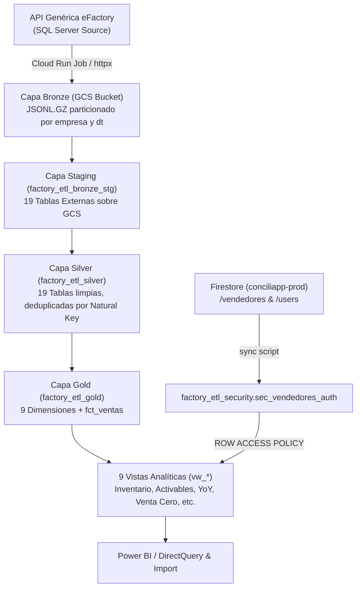

# 🤖 FACTORY-ETL — ARQUITECTURA, CATÁLOGO Y CONTEXTO COMPLETO PARA LLMs

Bienvenido al repositorio **`factory-etl`**. Este documento sirve como la **Guía Maestra y Contexto Técnico Autoritativo** para asistentes de inteligencia artificial (LLMs), desarrolladores e ingenieros de datos que trabajen en este proyecto.

---

## 📌 1. Resumen Ejecutivo y Misión del Proyecto

**`factory-etl`** es un **Data Lake y Data Warehouse Empresarial** construido sobre **Google Cloud Platform (GCP)**. Su propósito es ingerir, transformar, higienizar, gobernar y estructurar los datos operativos del ERP **FactorySoft / eFactory** para 5 empresas distribuidoras en Venezuela, alimentando modelos de inteligencia de negocios en **Power BI**, **Looker Studio** y portales analíticos.

### 🏢 Empresas / Tenants del Grupo:
| Código (`source_empresa`) | Nombre Comercial Oficial | Razón Social Fiscal | RIF Fiscal |
|---|---|---|---|
| **`tinito`** | **Comercial Tinito El Tigre** | Comercial Tinito El Tigre, C.A. | `J310904553` |
| **`ctb`** | **Comercial Tinito Barcelona** | Comercial Tinito Barcelona C.A. | `J409990001` |
| **`daroan`** | **Drinks and Food** | Drinks and Food C.A. | `J501104921` |
| **`ctm`** | **Comercial Tinito** | Comercial Tinito C.A. | `J298069104` |
| **`roldan`** | **Inversiones Roldan** | Inversiones Roldan, C.A. | `J303949827` |

- **Proyecto Target GCP (Dev):** `factory-etl-dev-0y1dhf` (Región: `us-central1`).
- **Data Lake Bronze Bucket:** `gs://factory-etl-dev-0y1dhf-bronze`.
- **Base de Datos Operacional de Identidad:** Firestore (`conciliapp-prod`).

---

## 🏗️ 2. Arquitectura Medallion (Staging $\rightarrow$ Silver $\rightarrow$ Gold)

La solución implementa la Arquitectura Medallion en **Google BigQuery**:



### Datasets en BigQuery:
1. **`factory_etl_bronze_stg`**: 19 Tablas Externas apuntando directamente a los objetos `JSONL.GZ` en GCS.
2. **`factory_etl_silver`**: 19 Tablas nativas consolidadas, higienizadas y deduplicadas por Clave Natural (`source_empresa` + ID primario).
3. **`factory_etl_gold`**: 9 Dimensiones (`dim_*`), Tabla de Hechos (`fct_ventas`) con **10.7+ millones de renglones** y 9 Vistas Analíticas (`vw_*`).
4. **`factory_etl_security`**: Tabla de Gobernanza `sec_vendedores_auth` con **475+ registros** de mapeo de accesos y políticas `ROW ACCESS POLICY`.
5. **`factory_etl_control_dev`**: Auditoría de lotes (`etl_runs` y `etl_batches`).

---

## 🗂️ 3. Catálogo de las 19 Entidades de Ingesta

El catálogo de consultas SQL en `src/factory_etl/factory_queries/` cubre 19 entidades versionadas:

### 📑 15 Tablas Maestras (Dimensiones):
1. `articulos_v1` (`cod_art`) — Catálogo de SKUs, marcas, peso y empaque.
2. `impuestos_v1` (`cod_imp`) — Alícuotas de IVA.
3. `departamentos_v1` (`cod_dep`) — Departamentos de producto.
4. `marcas_v1` (`cod_mar`) — Marcas comerciales.
5. `secciones_v1` (`cod_sec`) — Sub-categorías/Secciones.
6. `proveedores_v1` (`cod_pro`) — Fabricantes y proveedores.
7. `paises_v1` (`cod_pai`) — Países.
8. `estados_v1` (`cod_est`) — Estados.
9. `ciudades_v1` (`cod_ciu`) — Ciudades.
10. `vendedores_v1` (`cod_ven`) — Fuerza de ventas y rutas.
11. `sucursales_v1` (`cod_suc`) — Sucursales y almacenes centrales.
12. `almacenes_v1` (`cod_alm`) — Almacenes físicos de inventario.
13. `clientes_v1` (`cod_cli`) — Clientes, RIFs y coordenadas GPS derivadas (`latitud`, `longitud`).
14. `clases_clientes_v1` (`cod_cla`) — Segmentos de clientes.
15. `conceptos_v1` (`cod_con`) — Conceptos contables/transaccionales.

### 💳 4 Tablas Transaccionales:
16. `renglones_almacenes_v1` (`cod_alm`, `cod_art`) — Stock físico snapshot por almacén.
17. `ventas_diarias_v1` (`tipo_documento`, `cod_suc`, `documento`, `renglon`) — Renglones de facturas de venta (Parámetro: `fec_des` / `fec_has`).
18. `renglones_monedas_v1` (`cod_mon`, `renglon`) — Tasas de cambio de moneda (Parámetro: `fec_des` / `fec_has`).
19. `renglones_aprecios_v1` (`documento`, `renglon`) — Listas de precios.

---

## 📊 4. Especificación de Vistas Analíticas Gold (`vw_*`)

Todas las vistas residen en `factory_etl_gold` e incluyen la columna `nombre_empresa`:

1. **`vw_base_activable_clientes_90d`**: Clientes con compra en los últimos 90 días por vendedor/proveedor/sucursal, mostrando su Tasa de Activación en % del mes actual.
2. **`vw_base_activable_rif_90d`**: Tasa de activación deduplicada a nivel de RIF Fiscal / Razón Social.
3. **`vw_reporte_inventario`**: Stock físico de mercancía en cajas, kilogramos y toneladas por almacén y marca.
4. **`vw_clasificacion_clientes_frecuencia_semanal`**: Clasificación de clientes por frecuencia de compra semanal en el mes (Tipos 1, 2, 3 y **Tipo 4 = Compra todas las semanas del mes**).
5. **`vw_reporte_venta_cero_sku_mes_actual`**: Matriz de brechas de distribución (SKUs no comprados por cliente/vendedor en el mes actual).
6. **`vw_evolucion_sellout_yoy`**: Evolución diaria de ventas en USD y cajas comparada con el mismo día del año anterior (Year-over-Year).
7. **`vw_detalle_facturacion_clientes`**: Máximo nivel de detalle transaccional hasta número de factura, renglón, SKU, vendedor y cliente.
8. **`vw_evolucion_inventario_sellin`**: Evolución de stock e inteligencia de tiempo.
9. **`vw_maestro_clientes_activables`**: Listado renglón por renglón de la cartera activable con días sin comprar y estatus.

---

## 🔒 5. Gobernanza de Seguridad y Row-Level Security (RLS)

La gobernanza se integra con **FirebaseAuth** y **Firestore (`conciliapp-prod`)**:

### 🌐 Autenticación por Dominios:
- **`@tinitot.com` (Dominio Corporativo):** Analistas de Ventas, Gerentes de Empresa, Gerentes de Sucursal y Directiva.
- **`@gmail.com` (Dominio Externo):** Fuerza de ventas externa y Analistas de Proveedores (marcas).

### 👥 Matriz de Roles de Acceso:
| Rol (`role_type`) | Dominio | Alcance en BigQuery RLS |
|---|---|---|
| **`SUPERADMIN`** | `@tinitot.com` / `@gmail.com` | Acceso 100% Global |
| **`ANALISTA_VENTAS`** | `@tinitot.com` | Acceso Global a las 5 Empresas (Solo Lectura/Consultas) |
| **`GERENTE_EMPRESA`** | `@tinitot.com` | Acceso a **1, 2 o más Empresas Asignadas** |
| **`GERENTE_SUCURSAL`**| `@tinitot.com` | Acceso a Empresa y Sucursal Asignada |
| **`SUPERVISOR_VENTAS`**| `@tinitot.com` / `@gmail.com` | Acceso a Sucursal o Equipo de Vendedores asignados |
| **`VENDEDOR`** | `@gmail.com` | Acceso a sus códigos `cod_ven` y empresas asignadas (Multi-Ruta) |
| **`ANALISTA_PROVEEDOR`**| `@gmail.com` | Acceso exclusivo a los SKUs de su proveedor/marca (`cod_pro`) |

- **Tabla de Gobernanza:** `factory_etl_security.sec_vendedores_auth` (sincronizada desde Firestore `/vendedores` y `/users`).
- **Política SQL Nativa:** `ROW ACCESS POLICY` dinámica en `fct_ventas` evaluada con `SESSION_USER()`.

---

## 🤖 6. Reglas Estrictas de Integridad de Datos (No-Mock Policy)

> [!CAUTION]
> **REGLA INVARIANTE PARA LLMs (`.gemini/rules.md`):**
> Queda **estrictamente prohibido inventar o simular datos sintéticos/mocked** (tales como RIFs genéricos `J-00000000-X`, nombres ficticios o montos inventados). 
> **El deber ser:** Buscar siempre la información en BigQuery, el código fuente o solicitarla explícitamente al usuario.

---

## ⚙️ 7. Orquestación e Infraestructura en la Nube

1. **Cloud Run Job:** `factory-etl-articulos-dev` (Imagen Docker Python 3.12, Typer CLI, httpx, tenacity, structlog).
2. **Cloud Workflows:** `factory-etl-daily-dev` (Ejecución plana paralela con límite de concurrencia 10, completa en <5 minutos).
3. **Cloud Scheduler Dual-Schedule:**
   - **Corte de la Tarde:** `0 21 * * *` (5:30 PM VET / 21:30 UTC)
   - **Corte de la Noche:** `0 3 * * *` (11:45 PM VET / 03:45 UTC)
4. **Dataform CLI:** Modelo de transformaciones SQLX en `dataform/`.

---

## 🛠️ 8. Cheat Sheet de Comandos Operativos

```bash
# Setup de Entorno Local
uv sync --all-extras

# 1. Ingesta Diaria Local (Caja Chica / Debug)
uv run factory-etl run --query-id ventas_diarias_v1 --source-empresa tinito --params '{"fec_des":"2026-07-31","fec_has":"2026-07-31"}'

# 2. Seed Masivo por Quincenas
uv run python scratch/backfill_sales_biweekly.py ALL 2026 7 2

# 3. Reconstruir Arquitectura Medallion Completa (19 Entidades)
uv run python scratch/build_all_medallion_tables.py

# 4. Sincronizar Usuarios y Vendedores de Firestore a BigQuery RLS
uv run python scratch/sync_firestore_vendedores_to_bigquery.py

# 5. Auditar Ejecuciones de Workflows y Cloud Scheduler
uv run python scratch/check_workflow_executions.py

# 6. Sincronizar Cambios con Git / GitHub
uv run python scratch/git_commit_push.py
```
