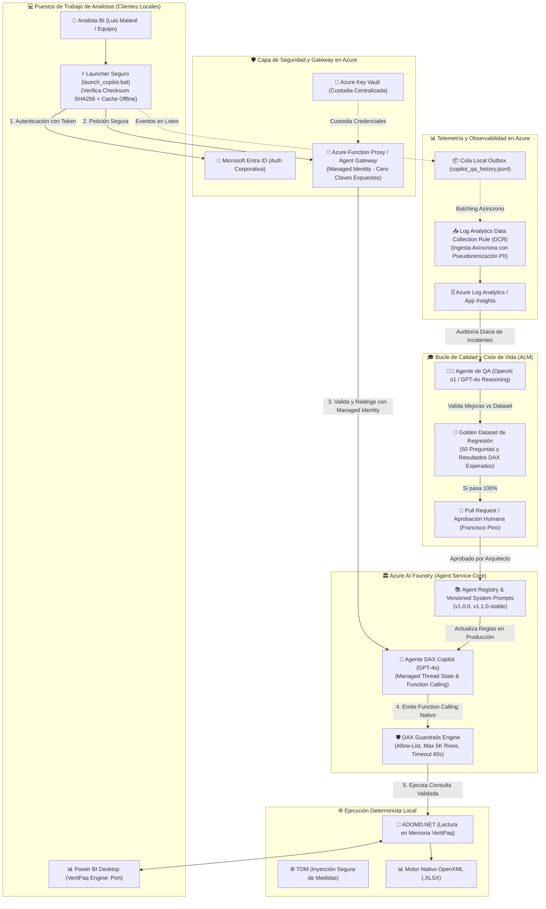
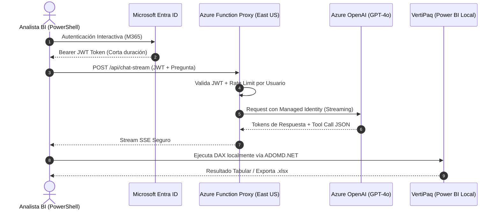

# 🚀 Plan Maestro: Despliegue, Gobernanza y Ciclo de Vida en Azure AI Foundry

**Proyecto:** Agente DAX Copilot para Power BI  
**Empresa:** Comercial Tinito  
**Fecha:** Agosto 2026  
**Documento:** Plan Integral de Arquitectura, Despliegue Zero-Touch, Seguridad (P0-P3) y Gestión de Ciclo de Vida (ALM) en Azure AI Foundry

---

## 1. Visión y Objetivos Estratégicos

Este documento consolida la arquitectura objetivo para transformar el prototipo local del **Agente DAX Copilot** en una plataforma empresarial robusta, segura y escalable gestionada integralmente en **Azure AI Foundry (Azure AI Agent Service)**.

### Pilares Clave del Plan:
1. **Seguridad y Custodia de Secretos (Resolución P0):** Eliminación total de API keys en scripts locales mediante Proxy Backend con Managed Identity y autenticación Microsoft Entra ID.
2. **Despliegue Confiable Zero-Touch con Fallback:** Ejecución verificada con checksum SHA256 y resiliencia offline.
3. **Gobernanza del Agente de QA (Human-in-the-Loop + Golden Dataset):** El agente evaluador propone mejoras vía Pull Requests y validación sobre un dataset de regresión antes de promover cambios a producción.
4. **Tool-Calling Determinista Nativo & Guardrails:** Adopción de Function Calling nativo de OpenAI/Foundry con límites de ejecución DAX (máx. 5.000 filas, timeout 60 s).
5. **Telemetría Robusta & Cumplimiento PII:** Ingesta por lotes con cola local *outbox*, pseudonimización de usuarios y retención controlada en Azure Log Analytics.

---

## 2. Diagrama de Arquitectura Objetivo en Azure AI Foundry



---

## 3. Matriz de Tratamiento de Brechas y Mejoras (P0 a P3)

| Prioridad | Oportunidad Identificada | Solución Arquitectural en Azure AI Foundry | Componente / Estado |
| :---: | :--- | :--- | :--- |
| **🔴 P0** | **Secreto API Key expuesto en `.ps1`** | Implementar **Azure Function Proxy con Managed Identity**. El cliente solo envía su token de Entra ID; la clave nunca sale de Azure. | **Azure Function Gateway** |
| **🔴 P0** | **`iex (irm ...)` sin verificación** | Launcher verifica **hash SHA256 publicado en Azure App Config** antes de ejecutar. Fallback a copia local firmada. | **`launch_copilot.bat` Seguro** |
| **🔴 P0** | **QA Agent auto-modificando reglas** | **Human-in-the-Loop + Golden Dataset:** El agente evaluador genera propuestas como Pull Requests en GitHub y requiere pasar 50 tests de regresión antes de despliegue. | **Bucle ALM en Foundry** |
| **🟠 P1** | **Telemetría frágil (`Start-Job`)** | Cola local *outbox* (`jsonl`) con reintentos y envío por lotes (*batching*) mediante **Log Analytics Ingestion API (DCR)**. | **Telemetry Outbox Worker** |
| **🟠 P1** | **Tool-calling por regex `[EXECUTE_DAX]`** | Migrar a **Function Calling nativo de OpenAI / Foundry Tools** con esquemas JSON estructurados y límite de 5 iteraciones ReAct. | **Native Tool Calling** |
| **🟠 P1** | **Sin Guardrails sobre DAX** | Interceptor que valida sintaxis (`EVALUATE`/`ROW`), aplica `TOPN 5000` de seguridad y `CommandTimeout = 60s`. | **DAX Guardrail Module** |
| **🟠 P1** | **Privacidad / PII en trazas** | Pseudonimización del usuario con SHA-256 (`hash(email)`), exclusión de valores literales sensibles y retención de 90 días en Log Analytics. | **Data Scrubbing Policy** |
| **🟡 P2** | **System Prompt en Base64** | Desacoplar a `system_prompt.md` en **Azure AI Foundry Prompt Registry** con versionado semántico (`v1.2.0`). | **Foundry Prompt Registry** |
| **🟡 P2** | **Resiliencia offline del Launcher** | Si no hay conexión a Azure/LAN, el launcher carga la **última copia local verificada** (`OFFLINE_CACHE`). | **Offline Fallback Engine** |
| **🟡 P2** | **Costos de Telemetría y QA** | Muestreo de eventos de éxito (10% en éxitos, 100% en errores). El QA Agent con modelo o1 solo analiza anomalías agregadas. | **Cost Optimization Filter** |
| **🟢 P3** | **Exportación nativa a Excel** | **Completado:** Motor OpenXML nativo que genera archivos `.xlsx` formateados con tablas, colores corporativos y autofiltros. | **`Export-NativeExcelXlsx` (Listo)** |
| **🟢 P3** | **Batería de Pruebas Pester** | 50 pruebas automatizadas sobre el modelo `Comercial_Tinito_Semantico_PROD` ejecutables vía CI/CD. | **Pester Test Suite** |

---

## 4. Diseño del Proxy Backend en Azure (Cero Secretos en Clientes)

### 4.1 Arquitectura del Proxy (Azure Function Consumption)
* **Costo mensual estimado:** **~$0.00 / mes** (dentro del *free tier* de 1M de ejecuciones y 400.000 GB-s).
* **Autenticación:** El analista inicia sesión en PowerShell con su cuenta corporativa Microsoft 365 (`Connect-AzAccount` o token MSAL interactivo).
* **Seguridad:** La Azure Function valida el token JWT del analista y utiliza **Managed Identity** para consultar Azure OpenAI sin que ningún usuario conozca la API Key.



---

## 5. Implementación del Ciclo de Vida del Agente en Azure AI Foundry (ALM)

### 5.1 Registro y Versionado del Agente (`azure-ai-projects` SDK)
```python
from azure.ai.projects import AIProjectClient
from azure.identity import DefaultAzureCredential

# Conectar al Proyecto Foundry de Comercial Tinito
client = AIProjectClient.from_connection_string(
    credential=DefaultAzureCredential(),
    conn_str="eastus.api.azureml.ms;sub_id;rg_tinito_bi;foundry_tinito_copilot"
)

# Definir herramientas estructuradas (Function Calling)
dax_tool = {
    "type": "function",
    "function": {
        "name": "ExecuteDaxQuery",
        "description": "Ejecuta una consulta DAX de solo lectura en el motor VertiPaq de Power BI.",
        "parameters": {
            "type": "object",
            "properties": {
                "daxQuery": {"type": "string", "description": "Sentencia DAX que inicia con EVALUATE."}
            },
            "required": ["daxQuery"]
        }
    }
}

# Registrar Agente con Versionado
agent = client.agents.create_agent(
    model="gpt-4o",
    name="Tinito-DAX-Copilot",
    instructions=open("prompts/system_prompt_v1.2.md", encoding="utf-8").read(),
    tools=[dax_tool],
    headers={"x-ms-enable-preview": "true"}
)
print(f"✔ Agente registrado en Foundry: {agent.name} (ID: {agent.id})")
```

---

### 5.2 Golden Dataset de Regresión para el Agente de QA
Antes de que cualquier actualización de reglas o prompts entre en producción, el pipeline de Foundry ejecuta automáticamente el **Golden Dataset**:

```json
[
  {
    "id": "TEST-001",
    "categoria": "03. Cartera y Cobertura",
    "pregunta": "Calcula la cartera activable de Mondelez en julio 2026 para CTB",
    "dax_esperado": "EVALUATE SUMMARIZECOLUMNS(vw_ventas_bi_consumo[nom_pro], TREATAS({\"ctb\"}, vw_ventas_bi_consumo[source_empresa]), TREATAS({\"0301\"}, vw_ventas_bi_consumo[cod_pro]), TREATAS({DATE(2026,7,1)}, dim_tiempo[fec_ini]), \"Cartera\", [Cartera_Activable_90D])",
    "resultado_esperado": {"Cartera": 2115},
    "criterio_tolerancia": "ExactMatch"
  },
  {
    "id": "TEST-002",
    "categoria": "05. Eficiencia y Ticket",
    "pregunta": "Dame el ticket promedio de venta por factura en mayo",
    "dax_esperado": "EVALUATE ROW(\"Ticket\", [Ticket_Promedio_Venta])",
    "criterio_tolerancia": "NonZeroNumeric"
  }
]
```

---

## 6. Hoja de Ruta de Implementación de la Nueva Arquitectura

```
SEMANA 1 (Seguridad P0 & Proxy):
  ├── 1. Rotación inmediata de API Keys expuestas.
  ├── 2. Despliegue de Azure Function Proxy con Managed Identity.
  └── 3. Actualización de 'launch_copilot.bat' con verificación SHA256.

SEMANA 2 (Foundry & Tool-Calling P1):
  ├── 4. Registro del Agente en Azure AI Foundry con Function Calling nativo.
  ├── 5. Implementación de DAX Guardrails (TOPN 5000 + Timeout 60s).
  └── 6. Módulo de Telemetría Outbox con pseudonimización PII.

SEMANA 3 (QA Agent & ALM P2-P3):
  ├── 7. Construcción del Golden Dataset de Regresión (50 casos de negocio).
  ├── 8. Pipeline de evaluación nocturna en Foundry con OpenAI o1 como Juez.
  └── 9. Flujo de aprobación Pull Request (Human-in-the-Loop) para nuevas reglas.
```

---

## 7. Resumen de Gobernanza y Beneficios

* **🔒 Seguridad Grado Empresarial:** Cero claves en máquinas locales, autenticación corporativa Entra ID y código verificado criptográficamente.
* **⚡ Rendimiento y Confiabilidad:** Consultas DAX protegidas contra bloqueos de memoria y exportación directa a Excel `.xlsx` nativo.
* **📈 Mejora Continua Auto-Supervisada:** El agente evoluciona con el uso diario, pero cada cambio es validado por el Golden Dataset y aprobado por el Arquitecto de Datos.
